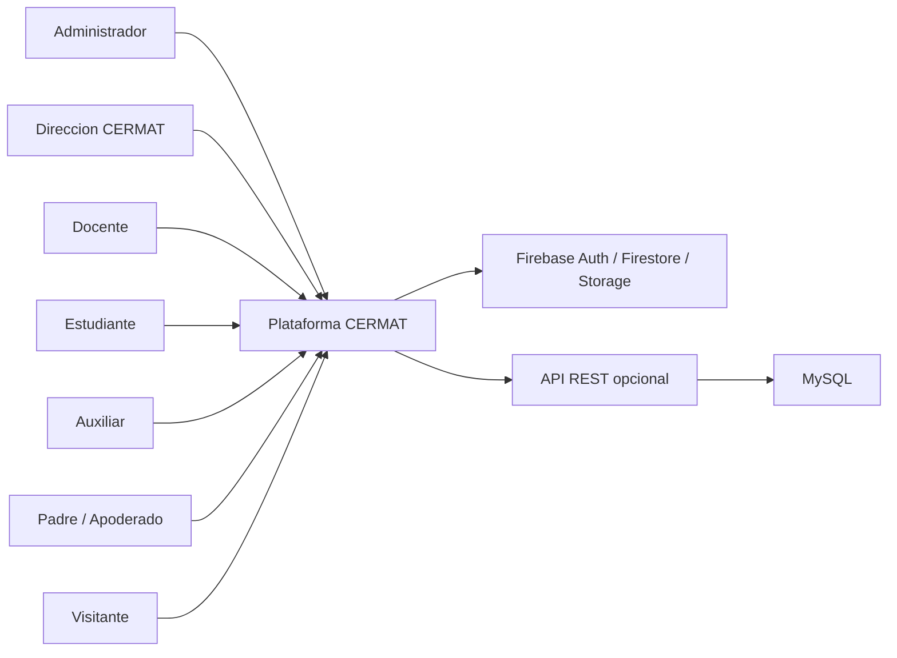
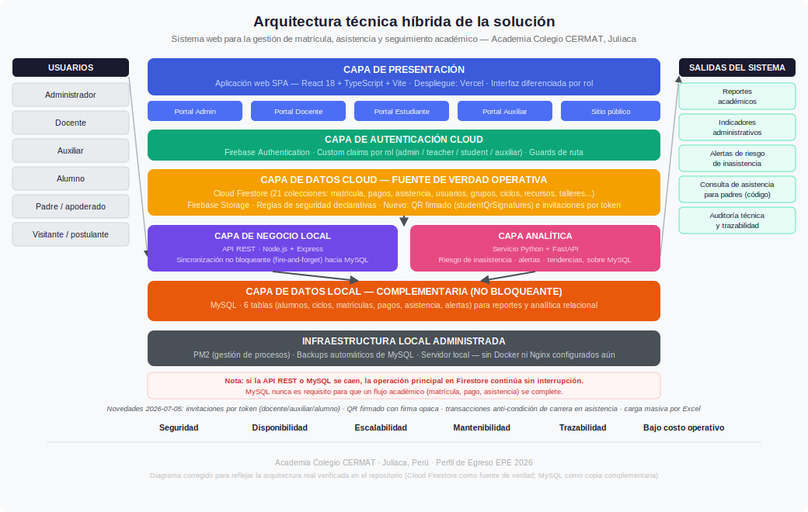
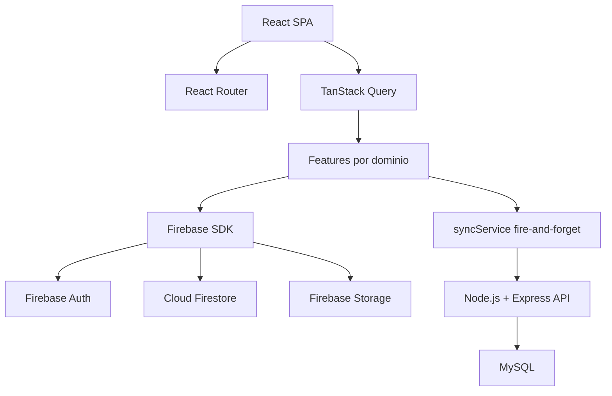

# Brief EPE — Plataforma Web Integral CERMAT

!!! abstract "Tipo de proyecto"
    Este documento corresponde a un proyecto de tipo **EPE (Evaluación de Perfil de Egreso)**, el nivel de mayor exigencia académica. El problema es real, los actores son verificables y el sistema está implementado y funcional.

## 1. Informacion general

| Campo | Detalle |
|---|---|
| Nombre del proyecto | Plataforma Web Integral de Gestion Academica CERMAT |
| Tipo | [ ] PS &nbsp;&nbsp; [ ] PI &nbsp;&nbsp; [x] EPE |
| Curso / Ciclo | Perfil de Egreso - Integracion de evidencias profesionales |
| Equipo | Equipo de desarrollo CERMAT |
| Fecha | 2026-06-22 |

## 2. Problema

!!! danger "Problema real — evidencia EPE"
    El problema es real, verificable en el contexto de una institución educativa activa en Juliaca, Perú. El sistema desarrollado responde a necesidades operativas concretas identificadas con los actores involucrados.

La Academia Colegio CERMAT requiere una plataforma digital integral para administrar de forma centralizada su oferta academica, matriculas, alumnos, docentes, auxiliares, asistencia, pagos, recursos, talleres, sedes, contenidos publicos y comunicacion con padres.

Antes del sistema, los procesos academicos y administrativos tienden a depender de canales dispersos: formularios no integrados, gestion manual de alumnos, control de asistencia poco trazable, seguimiento de pagos separado de la matricula, informacion publica dificil de mantener y ausencia de portales diferenciados por rol. Esto genera duplicidad de datos, baja visibilidad operativa, riesgo de errores en cupos/matriculas, demora en la atencion a padres y poca trazabilidad para decisiones administrativas.

Como proyecto **EPE**, el problema es real, verificable en el contexto de una institucion educativa y sustentado por los actores, modulos y reglas implementadas en el repositorio:

- Administracion de ciclos, sedes, grupos, recursos, docentes, alumnos, pagos, talleres y asistencia.
- Matricula publica conectada con el flujo interno de aprobacion y activacion.
- Portales por rol para administradores, docentes, estudiantes, auxiliares y padres.
- Reglas de seguridad en Firestore para proteger operaciones segun rol.
- Sincronizacion opcional hacia MySQL para analitica, reportes y continuidad operativa.

## 3. Contexto y Stakeholders

### Organizacion / entorno

La plataforma opera en el entorno de la **Academia Colegio CERMAT**, una institucion educativa que ofrece ciclos academicos, talleres, recursos formativos y servicios de seguimiento a estudiantes y padres.

El sistema funciona como una aplicacion web SPA, con datos operativos en Firebase y un backend Node.js + MySQL complementario para integracion y reportes.

### Usuarios / actores

| Stakeholder | Rol | Necesidad principal | Impacto esperado |
|---|---|---|---|
| Direccion / administracion CERMAT | Responsable institucional | Controlar ciclos, grupos, matriculas, pagos, sedes, docentes, auxiliares y contenidos. | Mayor trazabilidad, reduccion de trabajo manual y mejor visibilidad operativa. |
| Administrador del sistema | Usuario operativo interno | Gestionar informacion academica, usuarios, pagos, asistencia y publicaciones. | Operacion centralizada con permisos de alto nivel. |
| Docente | Usuario academico | Consultar cursos, alumnos, recursos y registrar asistencia mediante QR. | Mejor control de clases y seguimiento academico. |
| Estudiante | Usuario final | Ver cursos, recursos, estado de matricula, talleres y asistencia. | Experiencia academica personalizada. |
| Auxiliar | Soporte operativo | Supervisar asistencia y validar QR de estudiantes/docentes. | Control presencial mas rapido y trazable. |
| Padre / apoderado | Consulta externa | Ver asistencia de su hijo mediante codigo CERMAT. | Transparencia y seguimiento familiar. |
| Visitante / postulante | Usuario publico | Revisar ciclos, sedes, blog, talleres, recursos y registrar matricula. | Conversion de interesados en matriculas. |
| Equipo tecnico | Desarrollo y mantenimiento | Mantener una arquitectura modular, segura y escalable. | Evolucion controlada del sistema. |

### Mapa de stakeholders

## 4. Objetivo del sistema

Implementar una plataforma web integral que centralice la gestion academica, administrativa y comunicacional de CERMAT, permitiendo administrar ciclos, grupos, matriculas, pagos, usuarios, asistencia, recursos, talleres, sedes y contenidos publicos con portales diferenciados por rol y reglas de seguridad basadas en permisos.

### Objetivo medible EPE

Reducir la fragmentacion operativa mediante un sistema unico que:

- Centralice los principales procesos academicos y administrativos.
- Permita matricula publica y gestion interna de estados.
- Controle asistencia de estudiantes y docentes mediante QR.
- Exponga informacion publica actualizable desde administracion.
- Mantenga trazabilidad de pagos, usuarios, grupos y recursos.
- Proteja datos por rol mediante Firebase Authentication y Firestore Rules.

## 5. Alcance

### Incluye

- Sitio publico institucional: inicio, ciclos, sedes, blog, recursos, talleres, contacto y matricula.
- Gestion academica: ciclos, categorias, sedes, grupos, cupos, modalidad, turnos y horarios.
- Matricula en linea: registro publico, validacion de ciclo/grupo, seguimiento y estados.
- Gestion de pagos: registro, metodo de pago, cuotas, comprobantes, cancelacion logica y resumen administrativo.
- Gestion de usuarios: administradores, docentes, estudiantes y auxiliares.
- Activacion de cuentas para estudiantes y auxiliares.
- Portal administrativo completo.
- Portal docente con cursos, recursos y asistencia.
- Portal estudiante con cursos, recursos, matricula, talleres y asistencia.
- Portal auxiliar para supervision de asistencia.
- Consulta de asistencia para padres mediante codigo CERMAT.
- Gestion de recursos, blog, talleres y contenido del sitio.
- Reglas de seguridad Firestore por rol y coleccion.
- Sincronizacion opcional hacia API REST + MySQL para asistencia, pagos y matriculas.

### No incluye

- Aplicacion movil nativa.
- Pasarela de pagos automatizada con bancos o proveedores externos.
- Facturacion electronica integrada.
- Envio masivo de notificaciones push.
- Inteligencia artificial predictiva avanzada.
- Integracion directa con sistemas gubernamentales o ERP externos.
- Gestion contable completa fuera del alcance academico.

### Supuestos

- Los usuarios administradores poseen credenciales y permisos configurados en Firebase.
- Firestore es la fuente principal para la operacion web.
- MySQL funciona como almacenamiento complementario cuando la API REST esta habilitada.
- Los procesos de validacion institucional, pagos y estados finales dependen de administradores autorizados.

## 6. Datos

### Entidades principales

| Entidad | Proposito |
|---|---|
| `users` | Perfiles, roles, docentes, estudiantes, auxiliares y codigos de padres. |
| `cycles` | Ciclos academicos publicados o internos. |
| `cycleCategories` | Niveles/categorias academicas. |
| `campuses` | Sedes. |
| `groups` | Grupos por ciclo, sede, turno, horario, docente y cupo. |
| `enrollments` | Matriculas, estados, pagos esperados y datos del estudiante. |
| `payments` | Pagos registrados por matricula. |
| `attendanceTokens` | Tokens diarios para asistencia QR. |
| `attendanceLogs` | Registros de entrada/salida de estudiantes y docentes. |
| `parentAttendance` | Vista publica resumida para padres mediante codigo. |
| `resources` | Recursos academicos publicos o restringidos. |
| `posts` | Blog institucional. |
| `workshops` | Talleres publicos y privados. |
| `messages` | Mensajes de contacto. |
| `config` | Configuracion dinamica del sitio y servicios. |
| `invites`, `teacherInvites`, `auxiliarInvites` | Activacion e invitaciones por rol. |

### Origen de datos

- Formularios publicos: matricula, contacto y consulta.
- Panel administrativo: ciclos, sedes, recursos, blog, talleres, docentes, alumnos, pagos y configuracion.
- Portales autenticados: asistencia, recursos, cursos y estado de matricula.
- Firebase Authentication: identidad y sesion.
- Firestore: datos operativos principales.
- Firebase Storage: imagenes y archivos.
- API REST opcional: sincronizacion con MySQL.

### Restricciones

- Las lecturas y escrituras estan restringidas por Firestore Rules.
- La matricula publica solo permite ciclos publicados y grupos validos.
- La asistencia requiere usuario autenticado y tokens validos.
- Los pagos solo pueden ser administrados por usuarios admin.
- La eliminacion de pagos y matriculas no es libre; se prioriza trazabilidad.

## 7. Enfoque de solucion

!!! tip "Arquitectura híbrida — visión de conjunto"
    El sistema implementa una arquitectura técnica híbrida que combina una capa cloud (Firebase) para la operación web en tiempo real con una capa local (Node.js + MySQL) para analítica, reportes y continuidad operativa.

    

    *Imagen: Arquitectura técnica híbrida de la solución CERMAT — capas de presentación, autenticación, negocio, analítica, datos e infraestructura local administrada.*

### Tipo de sistema

Sistema **transaccional web** con componentes de gestion academica, administracion escolar, portal por roles, control de asistencia QR y sincronizacion complementaria hacia base de datos relacional.

### Consideraciones tecnicas

| Dimension | Decision |
|---|---|
| Frontend | React 18 + TypeScript + Vite |
| UI | Tailwind CSS + Radix UI + shadcn/ui + Lucide |
| Navegacion | React Router DOM |
| Estado remoto | TanStack React Query |
| Autenticacion | Firebase Authentication |
| Base principal | Cloud Firestore |
| Archivos | Firebase Storage |
| Seguridad | Firestore Rules + guards por rol |
| Backend complementario | Node.js + Express |
| Base complementaria | MySQL |
| Despliegue SPA | Vercel / hosting compatible con rewrite a `index.html` |

### Arquitectura basica

### Decisiones justificadas EPE

- **Arquitectura modular por dominio:** los modulos viven en `src/features/*`, facilitando mantenimiento y trazabilidad.
- **Firestore como base operacional:** permite sincronizacion en tiempo real, reglas de seguridad declarativas y desarrollo agil.
- **Roles diferenciados:** admin, docente, estudiante y auxiliar tienen rutas y permisos separados.
- **Asistencia QR:** reduce registro manual y mejora trazabilidad.
- **MySQL complementario:** habilita reportes, analitica y consultas relacionales sin bloquear la operacion principal.

### Arquitectura por capas

| Capa | Tecnología | Responsabilidad |
|---|---|---|
| **Presentación** | React 18 + TypeScript + Vite | SPA con portales diferenciados por rol |
| **Autenticación cloud** | Firebase Authentication | Identidad, sesión y claims por rol |
| **Datos cloud** | Cloud Firestore + Firebase Storage | Base de datos operativa en tiempo real |
| **Negocio local** | Node.js + Express | API REST, validación, lógica, auditoría |
| **Analítica** | Python + FastAPI | Procesamiento de históricos, alertas y tendencias |
| **Datos local** | MySQL | Base relacional para reportes y sincronización |
| **Infraestructura** | PM2 + backups automáticos | Gestión de servicios locales y respaldo |

## 8. Viabilidad

| Dimension | Evaluacion |
|---|---|
| Tecnica | Alta. El sistema ya cuenta con modulos implementados, rutas activas, reglas Firestore, servicios por dominio y esquema MySQL complementario. |
| Tiempo | Viable como EPE porque integra evidencias desarrolladas previamente y documenta un sistema funcional con modulos existentes. |
| Recursos | Viable con un equipo pequeno de desarrollo web, Firebase, Node.js y administradores institucionales para validacion. |
| Riesgos | Dependencia de configuracion correcta de roles, reglas Firestore, indices y calidad de datos migrados. |
| Mitigacion | Validaciones Zod, reglas de seguridad, separacion por rol, documentacion operativa y pruebas de build/lint. |

## 9. Alineacion con competencias

| Competencia | Marcado | Justificacion |
|---|---:|---|
| CE021 - Ingenieria de Requerimientos | X | El sistema cuenta con problema, actores, objetivos, alcance, requerimientos, prototipos, arquitectura y trazabilidad. |
| CE022 - Ingenieria de la Informacion | X | Gestiona entidades, colecciones, reglas de seguridad, sincronizacion SQL, consultas e indices. |
| CE023 - Programacion | X | Implementa modulos React/TypeScript, Firebase SDK, hooks, validaciones, rutas, componentes y servicios. |
| CE024 - QA | X | Incluye validaciones, control de estados, reglas de seguridad, restricciones de duplicidad y verificacion por build/lint. |

!!! success "Resultado de viabilidad"
    El sistema ya existe y está funcionando. La viabilidad no es proyectada sino **demostrada**: la plataforma opera con Firebase, Node.js y MySQL activos en PM2, con sincronización real entre capas.

## Rubrica de Aprobacion del Brief

| Criterio | Excelente (Aprobado alto) | Bueno (Aprobado) | Regular (Requiere ajuste) | Deficiente (No aprobado) | Evaluacion CERMAT |
|---|---|---|---|---|---|
| Claridad del problema | Problema claro, relevante y bien delimitado | Problema claro | Problema ambiguo | Problema confuso | Excelente |
| Coherencia problema-solucion | Solucion responde completamente al problema | Solucion adecuada | Relacion parcial | No hay relacion | Excelente |
| Alcance | Alcance completo y bien definido | Alcance claro | Alcance limitado/confuso | Sin alcance | Excelente |
| Viabilidad | Totalmente viable en el contexto | Viable con ajustes | Riesgo de inviabilidad | No viable | Excelente |
| Datos | Datos claramente identificados | Datos suficientes | Datos incompletos | Sin datos | Excelente |
| Contexto/Stakeholders | Actores claramente definidos | Actores identificados | Actores poco claros | Sin actores | Excelente |

### Criterio de aprobacion

**Resultado propuesto:** Aprobado alto.

El brief alcanza nivel excelente porque el problema es real, el alcance esta delimitado, los stakeholders estan identificados, la arquitectura existe en codigo y los datos principales estan definidos por modulos, reglas y esquemas.

## Frase clave

> El brief del proyecto es el punto de partida de la evaluacion por competencias, asegurando que la Plataforma CERMAT responde a un problema pertinente, viable y alineado con el perfil de egreso.
