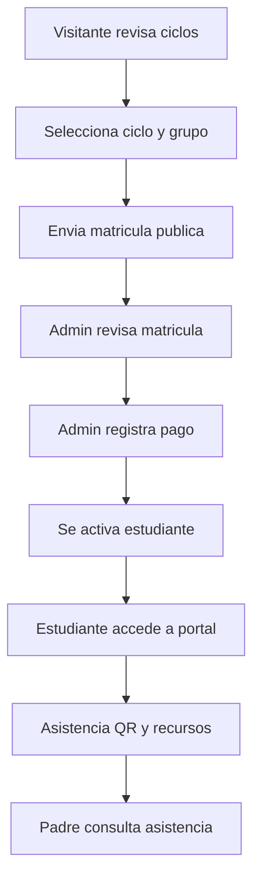
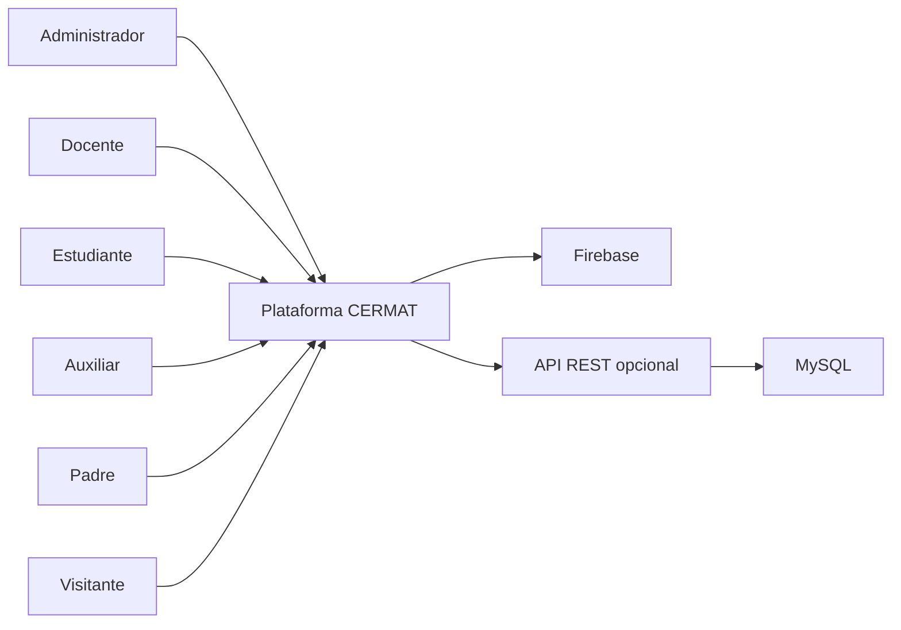
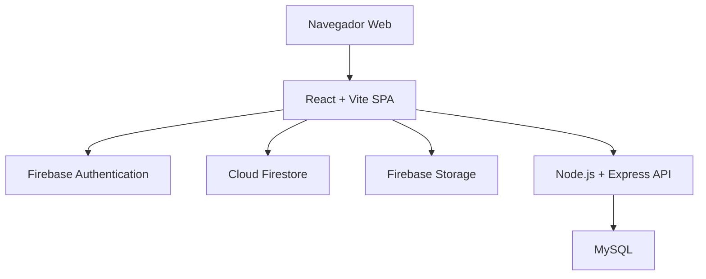
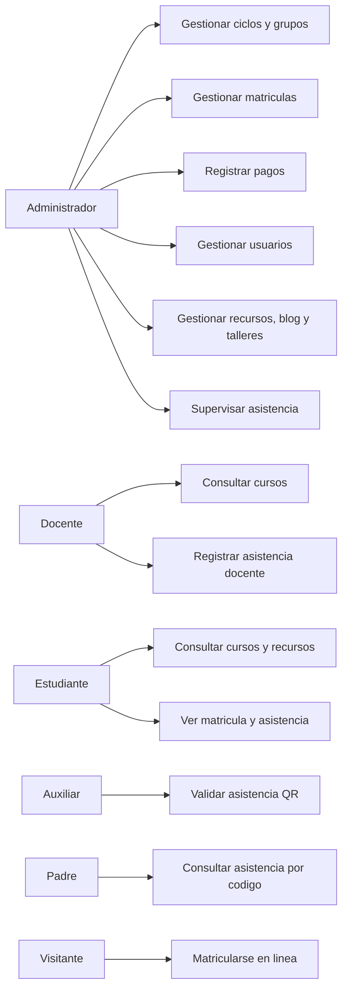
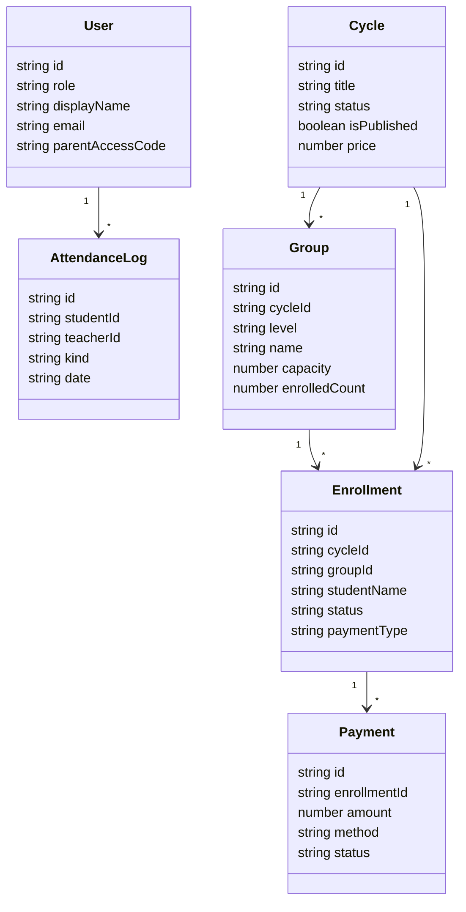
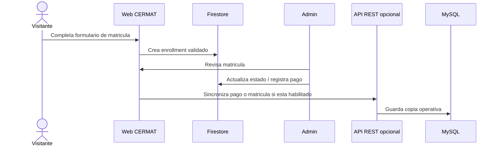

# E1 - Definicion del Sistema (CE021)

!!! abstract "Evidencia CE021 — Ingeniería de Requerimientos"
    Este entregable integra la especificación completa del sistema: requerimientos funcionales y no funcionales, prototipos navegables, arquitectura técnica híbrida, modelado UML y trazabilidad. Forma parte de la evaluación de **Perfil de Egreso (EPE)** del programa.

## 1. Informacion general

| Campo | Detalle |
|---|---|
| Proyecto | Plataforma Web Integral de Gestion Academica CERMAT |
| Tipo | [ ] PS &nbsp;&nbsp; [ ] PI &nbsp;&nbsp; [x] EPE |
| Curso / Ciclo | Perfil de Egreso - Evidencia integradora |
| Equipo | Equipo de desarrollo CERMAT |
| Fecha | 2026-07-05 |

## 2. Resumen Ejecutivo

Este entregable documenta la ingeniería de requerimientos del sistema **Plataforma Web Integral de Gestión Académica CERMAT**. Reúne el problema institucional real que resuelve, sus 8 grupos de stakeholders, el objetivo general y 9 objetivos específicos, un catálogo de **22 requerimientos funcionales (RF01–RF22)** y **10 requerimientos no funcionales (RNF01–RNF10)**, el prototipo navegable operativo (16 rutas reales en producción, no wireframes), la arquitectura técnica híbrida (React/Firebase + Node.js/MySQL), el modelado UML del dominio (casos de uso, clases, secuencia, C4) y la trazabilidad completa de cada requerimiento hacia su archivo fuente en el repositorio. La evidencia no es proyectada: corresponde a un sistema desplegado y en operación.

## 3. Descripcion del problema

!!! danger "Problema verificable — contexto institucional real"
    El problema no es hipotético. La Academia Colegio CERMAT opera en Juliaca, Perú, y sus procesos académicos, administrativos y de comunicación requerían centralización digital. Este sistema nació de necesidades operativas concretas validadas con los actores.

### Situacion actual

CERMAT requiere operar procesos academicos, administrativos y de comunicacion en un mismo ecosistema digital. La institucion necesita publicar oferta academica, recibir matriculas, administrar ciclos y grupos, controlar pagos, registrar asistencia, gestionar recursos, activar usuarios y ofrecer seguimiento a padres.

### Problema identificado

La gestion educativa sin una plataforma integrada produce:

- Informacion academica dispersa.
- Matriculas con seguimiento manual.
- Dificultad para controlar cupos, grupos, sedes y turnos.
- Baja trazabilidad de pagos y estados de matricula.
- Control de asistencia dependiente de registros manuales.
- Acceso limitado para docentes, estudiantes, auxiliares y padres.
- Riesgo de errores al actualizar contenidos publicos y datos operativos.

### Impacto en el negocio / contexto

El problema afecta directamente la eficiencia administrativa, la experiencia del estudiante, la atencion al padre de familia, el control de asistencia y la toma de decisiones institucionales. La plataforma reduce la dependencia de procesos aislados y convierte la operacion academica en un flujo centralizado, auditable y escalable.

## 4. Contexto del sistema

### Organizacion / entorno

La plataforma se desarrolla para la Academia Colegio CERMAT, institucion educativa que ofrece ciclos academicos, sedes, talleres, recursos y seguimiento a estudiantes.

### Usuarios

- Visitantes y postulantes.
- Administradores.
- Docentes.
- Estudiantes.
- Auxiliares.
- Padres o apoderados.

### Condiciones de operacion

- Aplicacion web SPA accesible desde navegador.
- Usuarios autenticados mediante Firebase Authentication.
- Datos principales en Cloud Firestore.
- Archivos e imagenes en Firebase Storage.
- Rutas protegidas por rol.
- API REST + MySQL habilitable para sincronizacion y reportes.

## 5. Stakeholders

| Stakeholder | Rol | Necesidad |
|---|---|---|
| Direccion CERMAT | Decisor institucional | Visibilidad de matriculas, asistencia, pagos y oferta academica. |
| Administrador | Operador principal | Gestionar ciclos, grupos, usuarios, pagos, recursos, talleres, sedes y contenido. |
| Docente | Responsable academico | Consultar cursos, alumnos, recursos y registrar asistencia. |
| Estudiante | Usuario academico | Acceder a cursos, recursos, talleres, matricula y asistencia. |
| Auxiliar | Soporte de control | Supervisar asistencia y validar QR. |
| Padre / apoderado | Seguimiento externo | Consultar asistencia del estudiante con codigo CERMAT. |
| Visitante / postulante | Usuario publico | Revisar oferta academica y matricularse. |
| Equipo tecnico | Mantenimiento | Evolucion segura de funcionalidades, datos y reglas. |

## 6. Objetivo del sistema

### Objetivo general

Desarrollar una plataforma web integral que centralice la gestion academica y administrativa de CERMAT, conectando oferta publica, matricula, pagos, usuarios, asistencia, recursos y portales por rol mediante una arquitectura segura basada en React, Firebase y servicios complementarios.

### Objetivos especificos

| ID | Objetivo especifico |
|---|---|
| OE01 | Publicar informacion institucional, ciclos, sedes, recursos, talleres y blog desde una plataforma administrable. |
| OE02 | Permitir matriculas en linea con validacion de ciclo, grupo, sede, turno y estado. |
| OE03 | Administrar usuarios por rol: administradores, docentes, estudiantes y auxiliares. |
| OE04 | Gestionar pagos, cuotas, comprobantes y estados de matricula. |
| OE05 | Registrar asistencia de estudiantes y docentes mediante QR y tokens diarios. |
| OE06 | Proveer portales privados diferenciados para administrador, docente, estudiante y auxiliar. |
| OE07 | Permitir consulta de asistencia para padres mediante codigo CERMAT. |
| OE08 | Proteger datos y operaciones mediante reglas de seguridad, claims y documentos de rol. |
| OE09 | Sincronizar datos clave hacia MySQL cuando la API REST este habilitada. |

## 7. Alcance

### Incluye

- Sitio publico institucional.
- Matricula publica.
- Gestion de ciclos, categorias, sedes y grupos.
- Gestion de matriculas, pagos y alumnos.
- Gestion de docentes y auxiliares.
- Activacion de cuentas.
- Portal administrativo.
- Portal docente.
- Portal estudiante.
- Portal auxiliar.
- Consulta publica de asistencia para padres.
- Gestion de recursos, talleres, blog, mensajes y configuracion.
- Control de asistencia QR.
- Reglas de seguridad Firestore.
- API REST complementaria para MySQL.

### No incluye

- App movil nativa.
- Facturacion electronica.
- Pasarela de pago automatizada.
- Integracion con ERP externo.
- Analitica predictiva avanzada.
- Notificaciones push masivas.
- Sistema contable completo.

## 8. Requerimientos del sistema (SRS)

!!! note "Alcance del SRS"
    El sistema cuenta con **22 requerimientos funcionales** (RF01–RF22) y **10 requerimientos no funcionales** (RNF01–RNF10). Todos están trazados hacia componentes de código fuente en la sección 12.

### 7.1 Requerimientos funcionales

| ID | Descripcion |
|---|---|
| RF01 | El sistema debe mostrar una pagina publica de inicio con informacion institucional y acceso a la oferta academica. |
| RF02 | El sistema debe listar ciclos academicos publicados y permitir ver su detalle. |
| RF03 | El sistema debe permitir matricula publica seleccionando ciclo, grupo, sede, turno y modalidad de pago. |
| RF04 | El sistema debe impedir matriculas publicas sobre ciclos no publicados, cerrados o grupos no validos. |
| RF05 | El administrador debe poder gestionar ciclos academicos, categorias, sedes y grupos. |
| RF06 | El administrador debe poder gestionar matriculas y actualizar estados como pendiente, pagado o cancelado. |
| RF07 | El administrador debe poder registrar pagos asociados a matriculas, incluyendo metodo, monto, cuota y comprobante. |
| RF08 | El administrador debe poder gestionar alumnos, docentes y auxiliares. |
| RF09 | El sistema debe permitir activar cuentas de estudiantes y auxiliares mediante flujos de invitacion. |
| RF10 | El docente debe poder acceder a sus cursos y consultar alumnos asociados. |
| RF11 | El docente debe poder acceder a recursos academicos asignados o creados. |
| RF12 | El sistema debe permitir registrar asistencia de estudiantes mediante QR. |
| RF13 | El sistema debe permitir registrar asistencia de docentes mediante QR diario validado por token. |
| RF14 | El auxiliar debe poder operar paneles de asistencia segun permisos. |
| RF15 | El estudiante debe poder ver su dashboard, cursos, recursos, matricula, talleres y asistencia. |
| RF16 | El padre debe poder consultar asistencia usando un codigo CERMAT sin acceso administrativo. |
| RF17 | El administrador debe poder publicar y administrar recursos academicos. |
| RF18 | El administrador debe poder publicar y administrar posts del blog. |
| RF19 | El administrador debe poder administrar talleres y su visibilidad publica. |
| RF20 | El sistema debe registrar mensajes de contacto desde el sitio publico. |
| RF21 | El sistema debe sincronizar pagos, matriculas y asistencia hacia la API REST cuando el servicio este habilitado. |
| RF22 | El sistema debe mantener rutas protegidas por rol: admin, teacher, student y auxiliar. |

### 7.2 Requerimientos no funcionales

| ID | Tipo | Descripcion |
|---|---|---|
| RNF01 | Seguridad | Las operaciones de lectura y escritura deben protegerse mediante Firebase Auth, claims, documentos de rol y Firestore Rules. |
| RNF02 | Usabilidad | La interfaz debe ser responsive y diferenciar claramente flujos publicos, administrativos y privados. |
| RNF03 | Rendimiento | Las consultas deben usar filtros compatibles con Firestore y evitar indices compuestos innecesarios cuando sea posible. |
| RNF04 | Mantenibilidad | El codigo debe organizarse por dominios en `src/features/*`, con `api.ts`, `hooks.ts`, `schemas.ts` y `types.ts`. |
| RNF05 | Disponibilidad | La operacion principal debe depender de Firebase; la API MySQL complementaria no debe bloquear el flujo principal si esta deshabilitada. |
| RNF06 | Integridad | Las matriculas, pagos y asistencia deben conservar trazabilidad mediante estados, timestamps y usuarios responsables. |
| RNF07 | Escalabilidad | La arquitectura debe permitir agregar nuevos modulos academicos sin reestructurar toda la aplicacion. |
| RNF08 | Compatibilidad | La aplicacion debe ejecutarse como SPA con build Vite y rutas manejadas por React Router. |
| RNF09 | Validacion | Los formularios deben validar datos con esquemas Zod y controles de dominio. |
| RNF10 | Auditoria | Las acciones criticas deben registrar responsable, fecha y estado cuando aplique. |

## 9. Prototipos

!!! tip "Prototipo operativo — no wireframe"
    Las pantallas del sistema no son bocetos estáticos. La aplicación es funcional y navegable en producción. Las rutas listadas abajo corresponden a páginas React reales con datos desde Firestore.

### Prototipos navegables

El sistema cuenta con pantallas funcionales implementadas como prototipo operativo:

| Pantalla / flujo | Ruta |
|---|---|
| Home publico | `/` |
| Ciclos | `/ciclos` |
| Detalle de ciclo | `/ciclos/:id` |
| Matricula en linea | `/matricula` |
| Recursos | `/recursos` |
| Sedes | `/sedes` |
| Talleres | `/talleres` |
| Login admin | `/admin/login` |
| Dashboard admin | `/admin` |
| Gestion de matriculas | `/admin/matriculas` |
| Gestion de pagos | `/admin/pagos` |
| Gestion de ciclos | `/admin/ciclos` |
| Gestion de grupos | `/admin/ciclos/:id/grupos` |
| Portal docente | `/docente` |
| Portal estudiante | `/student` |
| Portal auxiliar | `/auxiliar` |
| Consulta asistencia padres | `/asistencia-hijo` |

### Flujo de usuario principal

### Evidencia

- Rutas: `src/App.tsx`
- Paginas publicas: `src/pages/*`
- Paginas admin: `src/pages/admin/*`
- Portales docente/estudiante/auxiliar: `src/pages/teacher/*`, `src/pages/student/*`, `src/pages/auxiliar/*`
- Componentes de UI: `src/components/*`

## 10. Arquitectura del sistema

!!! info "Arquitectura técnica híbrida"
    La solución implementa una **arquitectura técnica híbrida** que combina una capa cloud para operación en tiempo real con una capa local para analítica, reportes y continuidad operativa. Esta combinación responde a la realidad operativa de una academia que necesita disponibilidad web inmediata (Firebase) y capacidad analítica relacional (MySQL).

    

    *Diagrama: Arquitectura técnica híbrida de la solución — sistema web inteligente para la gestión de matrícula, asistencia y seguimiento académico. Academia Colegio CERMAT, Juliaca.*

### Estilo arquitectonico

La solucion sigue una arquitectura **SPA modular por dominios**, conectada directamente a servicios Firebase y con un backend REST complementario para sincronizacion a MySQL.

### Componentes principales

| Componente | Responsabilidad |
|---|---|
| React SPA | Interfaz publica y privada del sistema. |
| React Router | Enrutamiento y separacion de portales. |
| Guards de ruta | Proteccion por rol. |
| TanStack Query | Cache y estado remoto. |
| Features | Capa de dominio para ciclos, matriculas, pagos, asistencia, recursos, usuarios y talleres. |
| Firebase Auth | Identidad, sesion y claims. |
| Cloud Firestore | Base operacional principal. |
| Firebase Storage | Imagenes y archivos. |
| Firestore Rules | Seguridad declarativa. |
| syncService | Sincronizacion no bloqueante hacia API. |
| API REST Node.js | Servicios complementarios para MySQL. |
| MySQL | Reportes, sincronizacion y consultas relacionales. |

### Diagrama C4 - Contexto

### Diagrama C4 - Contenedores

### Decisiones arquitectonicas clave

| Decision | Justificacion |
|---|---|
| Firebase como backend principal | Reduce complejidad operativa, permite reglas declarativas y datos en tiempo real. |
| Modulos por dominio | Facilita mantenimiento y evidencia de competencias. |
| Rutas por rol | Asegura experiencias separadas para admin, docente, estudiante y auxiliar. |
| MySQL como complemento | Permite reportes y consultas relacionales sin reemplazar Firestore. |
| Sincronizacion fire-and-forget | Evita que una caida de la API afecte operaciones principales. |
| Validaciones Zod | Mejora consistencia de datos antes de escribir en Firestore. |

## 11. Modelado del sistema (UML)

!!! info "Diagramas generados con Mermaid"
    Los diagramas UML siguientes — casos de uso, clases de dominio y secuencia — se renderizan automáticamente como SVG con Mermaid. Representan el modelo real del sistema, derivado de los módulos implementados en `src/features/*`.

### Diagrama de casos de uso

### Diagrama de clases de dominio (alto nivel)

### Diagrama de secuencia - matricula y pago

## 12. Trazabilidad

!!! success "Trazabilidad completa RF01–RF22"
    Cada requerimiento funcional tiene al menos un archivo fuente identificado. La trazabilidad fue derivada del repositorio real — no es estimada.

| Requerimiento | Componente |
|---|---|
| RF01 | `src/pages/Index.tsx`, `src/components/home/*` |
| RF02 | `src/pages/CiclosPage.tsx`, `src/features/cycles/*` |
| RF03 | `src/pages/MatriculaPage.tsx`, `src/features/enrollments/*` |
| RF04 | `firestore.rules`, `src/features/enrollments/schemas.ts` |
| RF05 | `src/pages/admin/AdminCiclosPage.tsx`, `AdminCycleGroupsPage.tsx`, `src/features/groups/*` |
| RF06 | `src/pages/admin/AdminEnrollmentsPage.tsx`, `src/features/enrollments/*` |
| RF07 | `src/pages/admin/AdminPaymentsPage.tsx`, `src/features/payments/*` |
| RF08 | `src/features/users/*`, `src/pages/admin/AdminDocentesPage.tsx`, `AdminAlumnosPage.tsx` |
| RF09 | `src/pages/ActivateStudentPage.tsx`, `src/pages/ActivateAuxiliarPage.tsx` |
| RF10 | `src/pages/teacher/TeacherCursosPage.tsx`, `src/pages/teacher/TeacherCursoAlumnosPage.tsx` |
| RF11 | `src/pages/teacher/TeacherRecursosPage.tsx`, `src/features/resources/*` |
| RF12 | `src/features/attendance/api.ts`, `src/pages/student/StudentAttendanceScanPage.tsx` |
| RF13 | `src/pages/teacher/TeacherAttendanceScanPage.tsx`, `src/features/attendance/api.ts` |
| RF14 | `src/pages/auxiliar/AuxiliarAttendanceQRPanel.tsx`, `src/pages/admin/AuxiliarDashboard.tsx` |
| RF15 | `src/pages/student/*`, `src/components/student/StudentLayout.tsx` |
| RF16 | `src/pages/ParentAttendancePage.tsx`, `src/lib/parentAccess.ts` |
| RF17 | `src/features/resources/*`, `src/pages/admin/AdminRecursosPage.tsx` |
| RF18 | `src/features/posts/*`, `src/pages/admin/AdminPostsPage.tsx` |
| RF19 | `src/features/workshops/*` |
| RF20 | `src/pages/ContactoPage.tsx`, `firestore.rules` |
| RF21 | `src/lib/syncService.ts`, `server/src/routes/*` |
| RF22 | `src/routes/AdminRoute.tsx`, `TeacherRoute.tsx`, `StudentRoute.tsx`, `AuxiliarRoute.tsx` |

## 13. Validacion con stakeholders

| Aspecto | Metodo de validacion | Evidencia | Observaciones |
|---|---|---|---|
| Oferta academica publica | Revision de rutas publicas y componentes de ciclos | `/ciclos`, `/ciclos/:id` | Permite decision de matricula. |
| Matricula | Prueba de flujo desde formulario publico hasta panel admin | `/matricula`, `/admin/matriculas` | Requiere ciclos/grupos validos. |
| Pagos | Revision de registro y trazabilidad de pagos | `/admin/pagos` | Asociado a matriculas. |
| Asistencia | Prueba de QR para estudiante/docente | `/student/attendance`, `/docente/qr-auxiliar` | Usa tokens y logs. |
| Padres | Consulta por codigo CERMAT | `/asistencia-hijo` | Acceso publico controlado por codigo. |
| Seguridad | Revision de Firestore Rules y guards | `firestore.rules`, `src/routes/*` | Separacion por rol. |
| Arquitectura | Revision de estructura `features` y rutas | `src/features/*`, `src/App.tsx` | Modularidad por dominio. |

## 14. Anexos

| Anexo | Contenido | Ubicacion en este documento |
|---|---|---|
| Matriz de trazabilidad | Relacion completa RF01-RF22 hacia archivo fuente | Seccion "12. Trazabilidad" |
| Acta de validacion con stakeholders | Metodo y evidencia de validacion por flujo funcional | Seccion "13. Validacion con stakeholders" |
| Diagramas complementarios | Casos de uso, clases de dominio, secuencia, C4 contexto y contenedores | Secciones "10. Arquitectura del sistema" y "11. Modelado del sistema (UML)" |
| Codigo fuente de referencia | Componentes y rutas citados en cada requerimiento | Repositorio `academia-school-platform`, columna "Componente" de la seccion "12. Trazabilidad" |

## 15. Rubrica de evaluacion

| Criterio | Excelente (18-20) | Bueno (15-17) | Regular (13-14) | Deficiente (<13) | Evaluacion CERMAT |
|---|---|---|---|---|---|
| Completitud y claridad de requerimientos | SRS completo, claro y estructurado (RF, RNF, reglas, restricciones) | SRS mayormente completo | Requerimientos incompletos o ambiguos | Requerimientos deficientes | Excelente |
| Coherencia entre requerimientos, prototipos y diseño del sistema | Prototipos y diseño reflejan fielmente los requerimientos | Coherencia general | Varias inconsistencias | No hay coherencia | Excelente |
| Definicion de arquitectura del sistema | Arquitectura clara, documentada y alineada al problema | Arquitectura funcional | Arquitectura parcial | No hay arquitectura | Excelente |
| Modelado del sistema (UML) | Diagramas completos y coherentes | Modelado adecuado | Modelado incompleto | No hay modelado | Bueno |
| Trazabilidad de requerimientos | Componentes rastreables a requerimientos | Trazabilidad parcial | Trazabilidad limitada | No hay trazabilidad | Excelente |
| Validacion con stakeholders | Evidencia clara de validacion | Validacion parcial | Validacion limitada | No hay validacion | Bueno |

!!! note "Sobre 'Bueno' en modelado UML y validacion con stakeholders"
    Los diagramas UML se generan con Mermaid a partir del modelo real de dominio, sin pasar por una herramienta CASE dedicada, y la validacion con stakeholders se documenta por metodo/evidencia de flujo mas que por actas firmadas individuales — de ahi la autoevaluacion conservadora en ambos criterios.

## Competencia evaluada

!!! abstract "CE021 — Ingeniería de Requerimientos"
    Este entregable forma parte de un sistema integrado y no se evalúa de manera aislada. En el contexto del **EPE**, integra evidencias desarrolladas previamente y las relaciona con actores, objetivos, alcance, requerimientos, arquitectura técnica híbrida y trazabilidad completa hacia el código fuente.
