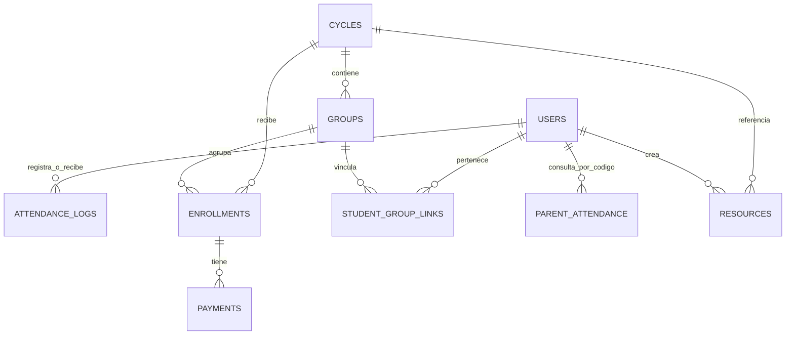

# E2 - Base de Datos del Sistema (CE022)

!!! abstract "Evidencia CE022 — Ingeniería de la Información"
    Este entregable documenta el diseño, implementación y operación de la base de datos del sistema CERMAT. El modelo de datos es **híbrido**: Cloud Firestore como fuente de verdad operativa y MySQL como capa analítica y relacional complementaria. Incluye esquema, consultas SQL, seguridad, rendimiento y consistencia con los requerimientos del sistema.

## 1. Informacion general

| Campo | Detalle |
|---|---|
| Proyecto | Plataforma Web Integral de Gestion Academica CERMAT |
| Tipo | [ ] PS &nbsp;&nbsp; [ ] PI &nbsp;&nbsp; [x] EPE |
| Curso / Ciclo | Perfil de Egreso - Evidencia integradora |
| Equipo | Equipo de desarrollo CERMAT |
| Fecha | 2026-07-05 |

## 2. Resumen Ejecutivo

Este entregable documenta la ingeniería de la información del sistema CERMAT bajo un modelo de datos **híbrido**: Cloud Firestore como fuente de verdad operativa (**21 colecciones documentadas**, verificadas directamente contra `firestore.rules`) y MySQL como capa relacional complementaria (**6 tablas activas**) para reportes y analítica. Cubre el modelo de datos y sus relaciones, el esquema lógico de cada colección/tabla, el script de implementación SQL (`server/src/db/schema.sql`), 5 consultas analíticas documentadas, la programación de datos vía capa de aplicación, la seguridad en tres capas (rutas protegidas, Firebase Auth, Firestore Rules), la estrategia de rendimiento basada en desnormalización deliberada, y la consistencia verificada entre este modelo de datos y los requerimientos definidos en el E1.

## 3. Modelo de datos

!!! info "Arquitectura de datos híbrida — Firebase + MySQL"
    La elección de dos motores de datos responde a necesidades distintas: Firestore provee sincronización en tiempo real, reglas declarativas y escalabilidad cloud; MySQL habilita consultas relacionales complejas, reportes agregados y analítica operativa sin límites del plan Firebase.

    

    *Diagrama: modelo de datos híbrido — la capa cloud gestiona la operación web en tiempo real mientras la capa local sostiene analítica, alertas automáticas y respaldo.*

### Enfoque de datos

El sistema utiliza un modelo hibrido:

- **Cloud Firestore** como base de datos principal para la operacion web.
- **Firebase Authentication** como fuente de identidad.
- **Firebase Storage** para imagenes y archivos.
- **MySQL** como base complementaria para sincronizacion, reportes y analitica operativa mediante API REST.

### Entidades Firestore principales

| Entidad / coleccion | Descripcion | Relaciones principales |
|---|---|---|
| `users` | Usuarios y perfiles por rol. | Se relaciona con asistencia, grupos, invitaciones y codigos de padres. |
| `cycles` | Ciclos academicos. | Tiene grupos, matriculas, recursos y visibilidad publica. |
| `cycleCategories` | Categorias o niveles. | Clasifica ciclos. |
| `campuses` | Sedes. | Se relaciona con ciclos, grupos y matriculas. |
| `groups` | Grupos academicos por ciclo. | Pertenece a ciclo, puede tener docente y matriculas. |
| `enrollments` | Matriculas. | Pertenece a ciclo, grupo y estudiante; recibe pagos. |
| `payments` | Pagos de matriculas. | Pertenece a una matricula. |
| `attendanceTokens` | Tokens diarios de asistencia. | Valida asistencia docente/QR. |
| `attendanceLogs` | Registros de asistencia. | Asociado a estudiante o docente. |
| `parentAttendance` | Vista publica por codigo para padres. | Relacionada con estudiante mediante codigo CERMAT. |
| `resources` | Recursos academicos. | Pueden ser publicos, de docente o para estudiantes. |
| `posts` | Blog institucional. | Gestionado por admin. |
| `workshops` | Talleres. | Publicos o privados segun estado. |
| `messages` | Contactos del sitio. | Leidos y gestionados por admin. |
| `config` | Configuracion del sitio y servicios. | Incluye configuracion de API REST opcional. |
| `invites` | Invitaciones de estudiantes. | Activacion de cuentas. |
| `teacherInvites` | Invitaciones docentes. | Alta/activacion docente. |
| `auxiliarInvites` | Invitaciones auxiliares. | Alta/activacion auxiliar. |
| `studentGroupLinks` | Relacion estudiante-grupo. | Vincula estudiante con grupo y matricula. |
| `attendanceDayState` | **Nueva (2026-07-05).** Estado transaccional del dia por estudiante/docente. | Evita condicion de carrera en marcaciones simultaneas; documento compuesto `{tipo}_{id}_{fecha}`. |
| `studentQrSignatures` | **Nueva (2026-07-05).** Firma opaca del QR permanente de cada estudiante. | Validada por Firestore Rules via `get()` cruzado antes de aceptar una marcacion. |
| `students` | Coleccion legacy de solo-admin, complementaria a `users`. | Acceso restringido a administradores. |

### Modelo ER alto nivel



## 4. Esquema de base de datos

### Esquema principal Firestore

Firestore no usa tablas relacionales, pero las colecciones tienen una estructura logica documentada:

#### `users`

| Campo | Tipo logico | Descripcion |
|---|---|---|
| `uid` | string | Identificador del usuario en Firebase Auth. |
| `email` | string | Correo del usuario. |
| `displayName`, `fullName`, `name` | string | Nombre visible segun flujo. |
| `role` | string | Rol: admin, teacher, student, auxiliar. |
| `authStatus` | string | Estado de cuenta: active, pending, etc. |
| `isActive` | boolean | Habilitacion operativa. |
| `parentAccessCode` | string/object | Codigo de consulta para padres. |
| `createdAt`, `updatedAt` | timestamp | Auditoria temporal. |

#### `cycles`

| Campo | Tipo logico | Descripcion |
|---|---|---|
| `title` | string | Nombre del ciclo. |
| `slug` | string | URL amigable. |
| `categoryIds` | array | Categorias asociadas. |
| `description` | string | Descripcion completa. |
| `status` | string | nuevo, activo, proximamente, cerrado. |
| `startDate`, `endDate` | timestamp/date | Fechas del ciclo. |
| `modality` | string | presencial, virtual, hibrido. |
| `shift` | string | manana, tarde, noche. |
| `campuses` | array | Sedes asociadas. |
| `schedule` | array | Horarios. |
| `price` | number | Precio al contado. |
| `installments` | number | Numero de cuotas. |
| `installmentPrice` | number | Precio por cuota. |
| `isPublished` | boolean | Visibilidad publica. |
| `createdAt`, `updatedAt` | timestamp | Auditoria. |

#### `groups`

| Campo | Tipo logico | Descripcion |
|---|---|---|
| `cycleId` | string | Ciclo al que pertenece. |
| `level` | string | primaria, secundaria, preuniversitario. |
| `gradeOrArea` | string | Grado o area. |
| `name` | string | Nombre del grupo. |
| `capacity` | number | Cupo maximo. |
| `enrolledCount` | number | Cantidad de matriculados. |
| `teacherUid` | string/null | Docente asignado. |
| `campusId`, `campusName` | string | Sede. |
| `shift` | string | Turno. |
| `schedule` | object | Dias y horas. |

#### `enrollments`

| Campo | Tipo logico | Descripcion |
|---|---|---|
| `cycleId`, `cycleTitle` | string | Ciclo seleccionado. |
| `groupId`, `groupName` | string | Grupo seleccionado. |
| `studentName` | string | Nombre del estudiante. |
| `phone` | string | Telefono. |
| `email` | string | Correo opcional. |
| `priceAtEnrollment` | number | Precio fijado en matricula. |
| `campus`, `campusId` | string | Sede. |
| `shift` | string | Turno normalizado. |
| `paymentType` | string | contado o cuotas. |
| `installments` | number/null | Cantidad de cuotas. |
| `status` | string | pendiente, pagado, cancelado. |
| `followUpStage` | string | Seguimiento comercial/academico. |
| `studentUid` | string | Usuario estudiante vinculado si aplica. |
| `createdAt`, `updatedAt` | timestamp | Auditoria. |

#### `payments`

| Campo | Tipo logico | Descripcion |
|---|---|---|
| `enrollmentId` | string | Matricula asociada. |
| `studentName` | string | Nombre desnormalizado. |
| `cycleTitle` | string | Ciclo desnormalizado. |
| `amount` | number | Monto pagado. |
| `method` | string | efectivo, yape, plin, transferencia, deposito. |
| `receiptNumber` | string | Comprobante. |
| `installmentNumber` | number/null | Numero de cuota. |
| `status` | string | confirmed o cancelled. |
| `recordedBy` | string | UID del admin. |
| `paidAt`, `createdAt`, `updatedAt` | timestamp | Auditoria. |

#### `attendanceLogs`

| Campo | Tipo logico | Descripcion |
|---|---|---|
| `studentId` | string | Estudiante, si aplica. |
| `studentName` | string | Nombre de estudiante. |
| `teacherId` | string | Docente, si aplica. |
| `teacherName` | string | Nombre de docente. |
| `subjectType` | string | student o teacher. |
| `scanSource` | string | student-qr o teacher-daily-qr. |
| `kind` | string | entry o exit. |
| `timestamp` | timestamp | Fecha/hora real. |
| `date` | string | Fecha local YYYY-MM-DD. |
| `token` | string | Token QR si aplica. |
| `recordedByUid` | string | Usuario que registro. |

### Esquema complementario MySQL

Archivo fuente: `server/src/db/schema.sql`.

| Tabla | Proposito |
|---|---|
| `alumnos` | Copia relacional de estudiantes y codigo de padres. |
| `ciclos` | Copia de ciclos academicos. |
| `matriculas` | Matriculas con alumno, ciclo, grupo, sede, turno y estado. |
| `pagos` | Pagos asociados a matriculas. |
| `asistencia` | Logs de asistencia. |
| `alertas` | Alertas operativas por alumno. |

### Claves primarias y foraneas logicas

| Relacion | Llave |
|---|---|
| `groups -> cycles` | `groups.cycleId` |
| `enrollments -> cycles` | `enrollments.cycleId` |
| `enrollments -> groups` | `enrollments.groupId` |
| `payments -> enrollments` | `payments.enrollmentId` |
| `attendanceLogs -> users` | `studentId` o `teacherId` |
| `studentGroupLinks -> users/groups/enrollments` | `studentUid`, `groupId`, `enrollmentId` |

## 5. Implementacion SQL

### Script de creacion de base de datos

La implementacion SQL esta disponible en:

```text
server/src/db/schema.sql
```

El script crea la base `cermat_db` y define tablas para alumnos, ciclos, matriculas, pagos, asistencia y alertas.

### Ejemplo resumido de tablas

```sql
CREATE DATABASE IF NOT EXISTS cermat_db
  CHARACTER SET utf8mb4
  COLLATE utf8mb4_unicode_ci;

CREATE TABLE IF NOT EXISTS alumnos (
  id VARCHAR(64) PRIMARY KEY,
  firebase_uid VARCHAR(64) UNIQUE NOT NULL,
  nombre VARCHAR(200) NOT NULL,
  email VARCHAR(255) DEFAULT '',
  parent_code VARCHAR(50) DEFAULT '',
  estado ENUM('activo','inactivo','egresado') DEFAULT 'activo'
);

CREATE TABLE IF NOT EXISTS matriculas (
  id VARCHAR(128) PRIMARY KEY,
  alumno_id VARCHAR(64) NOT NULL,
  ciclo_id VARCHAR(64) NOT NULL,
  grupo_id VARCHAR(64) DEFAULT '',
  estado ENUM('pendiente','pagado','cancelado') DEFAULT 'pendiente'
);
```

### Evidencia

- Archivo SQL: `server/src/db/schema.sql`
- API REST: `server/src/routes/*`
- Conexion MySQL: `server/src/db/mysql.ts`
- Sincronizacion frontend: `src/lib/syncService.ts`

## 6. Consultas (SQL)

!!! note "Consultas analíticas sobre MySQL"
    Las siguientes consultas se ejecutan sobre la base `cermat_db` en MySQL. No bloquean la operación principal en Firestore — son exclusivas de la capa analítica y de reportes administrativos.

Las siguientes consultas representan el uso analitico esperado de la base complementaria MySQL.

| ID | Descripcion |
|---|---|
| Q1 | Listar matriculas pendientes por ciclo. |
| Q2 | Calcular pagos confirmados por rango de fechas. |
| Q3 | Detectar alumnos con baja asistencia. |
| Q4 | Resumir asistencia diaria por estudiante. |
| Q5 | Identificar deudas por matricula en cuotas. |

### Q1 - Matriculas pendientes por ciclo

```sql
SELECT
  m.id,
  m.alumno_id,
  m.grupo_nombre,
  m.sede,
  m.turno,
  m.precio,
  m.monto_pagado,
  m.estado
FROM matriculas m
WHERE m.ciclo_id = ?
  AND m.estado = 'pendiente'
ORDER BY m.created_at DESC;
```

### Q2 - Total de pagos confirmados por fecha

```sql
SELECT
  DATE(p.pagado_en) AS fecha,
  p.metodo,
  SUM(p.monto) AS total
FROM pagos p
WHERE p.estado = 'confirmed'
  AND p.pagado_en BETWEEN ? AND ?
GROUP BY DATE(p.pagado_en), p.metodo
ORDER BY fecha DESC;
```

### Q3 - Alumnos con asistencia menor al 75%

```sql
SELECT
  a.alumno_id,
  MAX(a.alumno_nombre) AS alumno,
  COUNT(DISTINCT a.fecha) AS dias_asistidos
FROM asistencia a
WHERE a.fecha >= DATE_SUB(CURDATE(), INTERVAL 30 DAY)
GROUP BY a.alumno_id
HAVING dias_asistidos < 23
ORDER BY dias_asistidos ASC;
```

### Q4 - Historial de asistencia por alumno

```sql
SELECT
  fecha,
  MIN(CASE WHEN tipo = 'entry' THEN hora END) AS hora_entrada,
  MAX(CASE WHEN tipo = 'exit' THEN hora END) AS hora_salida
FROM asistencia
WHERE alumno_id = ?
GROUP BY fecha
ORDER BY fecha DESC;
```

### Q5 - Matriculas con saldo pendiente

```sql
SELECT
  m.id,
  m.alumno_id,
  m.ciclo_titulo,
  m.precio,
  m.monto_pagado,
  (m.precio - m.monto_pagado) AS saldo
FROM matriculas m
WHERE m.estado <> 'cancelado'
  AND (m.precio - m.monto_pagado) > 0
ORDER BY saldo DESC;
```

## 7. Programacion de base de datos

### Procedimientos / funciones

En la implementacion actual no se observan procedimientos almacenados obligatorios. La programacion de datos se gestiona principalmente desde:

- Firestore SDK en `src/features/*/api.ts`.
- Reglas de seguridad en `firestore.rules`.
- API REST Node.js para sincronizacion.
- Servicios `syncEnrollment`, `syncPayment` y `syncAttendanceLog`.

### Triggers

No se identifican triggers SQL requeridos en la version actual. La consistencia operacional se maneja a nivel de aplicacion y reglas.

### Programacion equivalente en aplicacion

| Funcion | Archivo | Responsabilidad |
|---|---|---|
| `syncEnrollment` | `src/lib/syncService.ts` | Enviar matricula a API REST si esta habilitada. |
| `syncPayment` | `src/lib/syncService.ts` | Sincronizar pagos nuevos o cancelados. |
| `syncAttendanceLog` | `src/lib/syncService.ts` | Sincronizar asistencia QR. |
| `getOrCreateTodayAttendanceTokens` | `src/features/attendance/api.ts` | Crear o recuperar tokens diarios. |
| `logAttendanceScan` | `src/features/attendance/api.ts` | Registrar asistencia de estudiante. |
| `logTeacherAttendanceScan` | `src/features/attendance/api.ts` | Registrar asistencia de docente. |

## 8. Seguridad de la base de datos

!!! warning "Seguridad en tres capas independientes"
    La protección de datos no depende de una sola barrera. Se aplica en: (1) rutas protegidas por rol en el frontend, (2) Firebase Authentication con custom claims, y (3) Firestore Rules declarativas por colección. La API REST además exige token Firebase válido en cada llamada de sincronización.

### Usuarios y roles

| Rol | Permisos generales |
|---|---|
| Admin | Gestion completa de ciclos, grupos, usuarios, matriculas, pagos, recursos, talleres, asistencia y configuracion. |
| Teacher | Acceso a cursos, recursos propios/asignados y asistencia segun reglas. |
| Student | Acceso a su informacion, cursos, recursos, matricula y asistencia. |
| Auxiliar | Acceso operativo a paneles de asistencia. |
| Publico | Lectura de informacion publicada y envio de formularios permitidos. |
| Padre | Consulta por codigo de asistencia, sin acceso administrativo. |

### Control de accesos

La seguridad se aplica en tres capas:

1. **Rutas protegidas:** `AdminRoute`, `TeacherRoute`, `StudentRoute`, `AuxiliarRoute`.
2. **Autenticacion:** Firebase Authentication y custom claims.
3. **Firestore Rules:** restricciones por coleccion, rol, estado y estructura de datos.

### Reglas destacadas

| Recurso | Control aplicado |
|---|---|
| `cycles` | Lectura publica solo si publicado; escritura admin. |
| `groups` | Escritura admin; lectura publica si el ciclo asociado esta publicado. |
| `enrollments` | Creacion publica restringida por ciclo/grupo valido; lectura y actualizacion controlada. |
| `payments` | Lectura y escritura solo admin; eliminacion bloqueada. |
| `attendanceTokens` | Gestion admin; lectura para roles operativos autorizados. |
| `attendanceLogs` | Creacion solo si cumple reglas de QR/token; lectura segun rol. |
| `parentAttendance` | Consulta publica por codigo; escritura controlada. |
| `messages` | Creacion publica; administracion solo admin. |

### Proteccion de datos

- No se expone lectura publica completa de matriculas.
- Los pagos no se eliminan fisicamente desde cliente.
- Las consultas de padres estan acotadas por codigo CERMAT.
- La asistencia docente usa tokens diarios con vigencia.
- La sincronizacion REST requiere usuario autenticado y token de Firebase.

## 9. Rendimiento y optimizacion

!!! tip "Estrategia de rendimiento — desnormalización deliberada"
    El sistema usa desnormalización selectiva en Firestore (nombre del estudiante, título del ciclo, sede y monto en documentos de pago) para eliminar lecturas encadenadas y acelerar las vistas administrativas. MySQL complementa con agregados que serían costosos sobre Firestore.

### Indices

Firestore requiere indices segun combinaciones de filtros. El sistema evita varios indices compuestos aplicando estrategias como:

- Campo `date` para filtrar asistencia docente por dia.
- Filtros en memoria cuando evita combinaciones costosas.
- Datos desnormalizados en pagos para visualizacion rapida.
- Campos normalizados en matriculas para busqueda y trazabilidad.

### Consultas optimizadas

| Caso | Estrategia |
|---|---|
| Asistencia por fecha | Filtro por `date` o rango de `timestamp`. |
| Pagos admin | Datos desnormalizados: estudiante, ciclo, sede, telefono y monto. |
| Matriculas | Estado, ciclo, grupo y seguimiento como campos directos. |
| Ciclos publicos | Lectura condicionada por `isPublished` y `status`. |
| Padres | Consulta por codigo en lugar de exponer perfiles completos. |

### Analisis basico de rendimiento

- La SPA reduce carga del servidor tradicional.
- Firebase escala automaticamente para lecturas/escrituras dentro de limites del plan.
- TanStack Query evita recargas innecesarias.
- MySQL complementa reportes agregados sin sobrecargar Firestore.
- La sincronizacion `fire-and-forget` evita bloquear la experiencia de usuario.

## 10. Consistencia con el sistema

!!! success "Consistencia demostrada — datos activos en producción"
    El modelo de datos de este entregable no es teórico. Firestore opera con datos reales desde el despliegue inicial; MySQL recibe sincronización en tiempo real de asistencia, matrículas y pagos mediante el patrón fire-and-forget implementado en `src/lib/syncService.ts`.

### Soporte a requerimientos E1

| Requerimiento | Datos que lo soportan |
|---|---|
| Gestion de ciclos | `cycles`, `cycleCategories`, `campuses` |
| Gestion de grupos | `groups`, `studentGroupLinks` |
| Matricula publica | `enrollments`, `cycles`, `groups` |
| Pagos | `payments`, `enrollments` |
| Usuarios por rol | `users`, Firebase Auth, custom claims |
| Asistencia QR | `attendanceTokens`, `attendanceLogs`, `parentAttendance` |
| Recursos y contenido | `resources`, `posts`, `workshops`, `config` |
| Padres | `users.parentAccessCode`, `parentAttendance` |
| Sincronizacion | `syncService`, API REST, MySQL |

### Soporte a funcionalidad E3

Aunque E3 no se desarrolla en este documento, la base de datos soporta la implementacion de programacion mediante:

- APIs por dominio en `src/features/*/api.ts`.
- Hooks por dominio en `src/features/*/hooks.ts`.
- Validaciones Zod en `schemas.ts`.
- Tipos TypeScript en `types.ts`.
- Rutas y componentes React conectados a datos reales.

### Integridad de datos

| Riesgo | Mecanismo de control |
|---|---|
| Matriculas duplicadas | Claves deterministicas/reglas y validaciones de payload segun implementacion actual. |
| Pago sin matricula | Regla Firestore exige existencia de enrollment asociado. |
| Asistencia invalida | Token diario, usuario autenticado y validacion de estudiante/docente. |
| Lectura no autorizada | Guards de ruta y Firestore Rules. |
| Datos incompletos | Esquemas Zod y campos obligatorios por dominio. |
| Caida de API REST | Sincronizacion no bloqueante; Firestore mantiene operacion principal. |

## 11. Anexos

| Anexo | Contenido | Ubicacion en este documento |
|---|---|---|
| Script SQL completo | DDL de las 6 tablas MySQL (`alumnos`, `ciclos`, `matriculas`, `pagos`, `asistencia`, `alertas`) | `server/src/db/schema.sql`, referenciado en seccion "5. Implementacion SQL" |
| Consultas SQL documentadas | Q1-Q5 con proposito analitico y codigo completo | Seccion "6. Consultas (SQL)" |
| Diccionario de datos Firestore | Campos, tipo logico y descripcion por coleccion | Seccion "4. Esquema de base de datos" |
| Diagrama ER | Relaciones entre colecciones principales | Seccion "3. Modelo de datos" |

## 12. Rubrica de evaluacion

| Criterio | Excelente | Bueno | Regular | Deficiente | Evaluacion CERMAT |
|---|---|---|---|---|---|
| Modelado de datos | Modelo consistente, normalizado y alineado | Modelo adecuado | Modelo incompleto | Modelo incorrecto | Excelente |
| Integridad y consistencia de datos | Integridad referencial completa | Integridad funcional | Problemas de consistencia | Datos inconsistentes | Bueno |
| Implementacion y consultas SQL | Consultas correctas y eficientes | Consultas funcionales | Consultas deficientes | Sin consultas | Excelente |
| Programacion de base de datos | Uso adecuado de logica en BD | Uso funcional | Uso limitado | No hay programacion | Bueno |
| Seguridad y administracion | Control de accesos y seguridad definidos | Seguridad basica | Seguridad parcial | Sin seguridad | Excelente |
| Rendimiento y optimizacion | Indices y consultas optimizadas | Rendimiento aceptable | Problemas de rendimiento | Sistema ineficiente | Bueno |

!!! note "Sobre 'Bueno' en programacion de BD, integridad y rendimiento"
    El sistema no usa procedimientos almacenados ni triggers SQL — la logica de datos vive en la capa de aplicacion (`api.ts` + Firestore Rules), una decision arquitectonica valida para Firestore pero que no demuestra programacion SQL avanzada. La integridad referencial en Firestore se aplica por reglas y convencion, no por llaves foraneas nativas. El rendimiento se apoya en desnormalizacion manual, no en analisis formal de planes de ejecucion MySQL.

## Competencia evaluada

!!! abstract "CE022 — Ingeniería de la Información"
    Este entregable forma parte de un sistema integrado y no se evalúa de manera aislada. En el contexto del **EPE**, integra el modelo de datos operativo de Firestore (21 colecciones documentadas), el esquema relacional complementario en MySQL (6 tablas activas), reglas de seguridad por capa, consultas analíticas SQL, estrategias de rendimiento y consistencia completa con los requerimientos del sistema.
