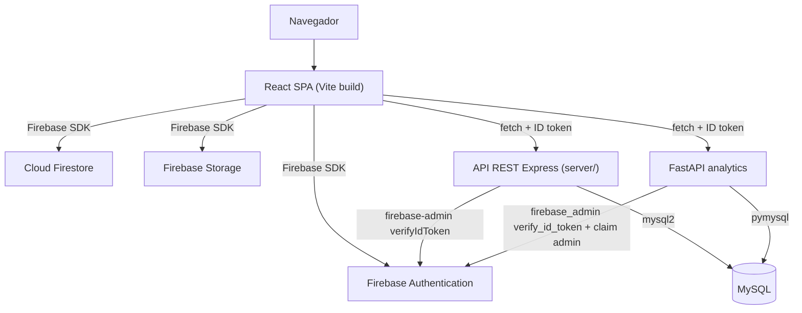

# E3 - Sistema de Software Funcional Integrado (CE023)

!!! abstract "Evidencia CE023 — Programación"
    Este entregable documenta el sistema de software **funcional y desplegado** que implementa los requerimientos del E1 sobre el modelo de datos del E2. No es una maqueta: es la aplicación React + TypeScript en ejecución, integrada con Firebase, una API REST Node.js y un servicio de analítica en Python, operando con datos reales de la Academia Colegio CERMAT.

## 1. Informacion general

| Campo | Detalle |
|---|---|
| Proyecto | Plataforma Web Integral de Gestion Academica CERMAT |
| Tipo | [ ] PS &nbsp;&nbsp; [ ] PI &nbsp;&nbsp; [x] EPE |
| Curso / Ciclo | Perfil de Egreso - Evidencia integradora |
| Equipo | Equipo de desarrollo CERMAT |
| Repositorio | `academia-school-platform` (raíz del proyecto) |
| URL de despliegue | `https://www.cermatschool.edu.pe` (dominio de producción configurado en `analytics/main.py` / CORS) — verificar que resuelve antes de la sustentación |
| Fecha | 2026-07-05 |

## 2. Resumen Ejecutivo

Este entregable documenta el sistema de software **funcional y desplegado** que implementa los requerimientos del [E1](e1-definicion-sistema-ce021.md) sobre el modelo de datos del [E2](e2-base-datos-ce022.md). Describe la arquitectura de integración entre cuatro procesos reales (SPA React, API REST Node.js, servicio de analítica FastAPI y Firebase como autoridad de identidad y datos), los flujos funcionales verificados en esta iteración (QR firmado de asistencia, invitación y auto-activación de docentes, carga masiva por Excel, corrección de condiciones de carrera), los patrones de código aplicados para evitar duplicación entre módulos, y el proceso real de despliegue e instalación de cada proceso.

## 3. Arquitectura e integracion

!!! info "Cuatro procesos, una sola fuente de verdad"
    El sistema no es un monolito único: es una SPA que habla directamente con Firebase para toda la operación en tiempo real, y de forma opcional y no bloqueante sincroniza una copia hacia una API REST propia que alimenta MySQL y un servicio de analítica en Python. Si la API o MySQL caen, la operación principal en Firestore no se ve afectada.

### Componentes desplegables del sistema

| Proceso | Tecnologia | Ubicacion en el repo | Rol |
|---|---|---|---|
| Frontend SPA | React 18 + TypeScript + Vite | `src/` | Interfaz publica y portales por rol |
| API REST | Node.js + Express + TypeScript | `server/src/` | Sincronizacion hacia MySQL, salud del servicio |
| Servicio de analitica | Python + FastAPI | `analytics/main.py` | Alertas de inasistencia, tendencias, endpoints protegidos |
| Base operativa | Cloud Firestore | Firebase (config en `src/lib/firebase.ts`) | Fuente de verdad para toda la app |
| Base complementaria | MySQL | `server/src/db/schema.sql` | Reportes relacionales y respaldo |

### Integracion entre capas



- El **frontend** habla con Firebase directamente para todas las operaciones críticas (matrícula, pagos, asistencia, usuarios). Es la vía síncrona y obligatoria.
- La **API REST** (`server/src/index.ts`) expone `/health`, `/api/asistencia`, `/api/pagos`, `/api/sync`; usa `helmet`, `cors` restringido por `CORS_ORIGINS` y `morgan` para logging. Corre bajo PM2 (`npm run pm2:start`) en producción.
- El **servicio de analítica** (`analytics/main.py`) expone endpoints de solo lectura (`GET`) y un `PATCH`, protegidos por `require_admin`: exige `Authorization: Bearer <idToken>` y verifica el custom claim `admin` de Firebase — el mismo claim que usan las Firestore Rules, para que la regla de autorización sea una sola en todo el sistema.
- Los tres procesos comparten el mismo proyecto de Firebase como autoridad de identidad: no hay un segundo sistema de usuarios/contraseñas.

### Patron de sincronizacion fire-and-forget

`src/lib/syncService.ts` envía copias de matrícula, pago y asistencia hacia la API REST **sin bloquear** la operación principal: si la petición falla o la API está apagada, el usuario no percibe error porque Firestore ya confirmó la escritura real. Esto evita que un componente secundario (reportes SQL) se convierta en un punto único de falla del flujo académico.

## 4. Funcionalidad del sistema

!!! tip "22 requerimientos funcionales, con evidencia de código para cada uno"
    La trazabilidad completa RF01–RF22 está documentada en la sección 12 del [E1](e1-definicion-sistema-ce021.md). Aquí se describe el comportamiento observable del sistema en ejecución.

### Portales por rol

| Portal | Rutas raiz | Guard | Funciones principales |
|---|---|---|---|
| Publico | `/`, `/ciclos`, `/matricula`, `/recursos`, `/sedes`, `/talleres`, `/blog`, `/contacto` | Ninguno | Informacion institucional, matricula publica, consulta de asistencia por codigo |
| Administrador | `/admin/*` | `AdminRoute` | Ciclos, grupos, matriculas, pagos, alumnos, docentes, auxiliares, recursos, posts, talleres, asistencia |
| Docente | `/docente/*` | `TeacherRoute` | Cursos, alumnos, recursos, marcacion de asistencia diaria por QR |
| Estudiante | `/student/*` | `StudentRoute` | Cursos, recursos, estado de matricula, talleres, marcacion de asistencia |
| Auxiliar | `/auxiliar/*`, panel en `/admin` | `AuxiliarRoute` | Panel de escaneo QR, supervision de marcaciones |

### Flujos funcionales implementados y verificados en esta iteracion

| Flujo | Descripcion | Evidencia |
|---|---|---|
| Matricula publica -> activacion | Visitante se matricula, admin registra pago, estudiante se activa con cuenta propia | `src/pages/MatriculaPage.tsx`, `src/pages/ActivateStudentPage.tsx` |
| Marcacion de asistencia con QR firmado | Cada estudiante tiene un QR permanente con firma criptografica opaca almacenada en `studentQrSignatures`; el escaneo valida la firma contra Firestore Rules antes de aceptar el registro | `src/features/attendance/studentQr.ts`, `src/lib/qrPayload.ts`, `firestore.rules` |
| Secuencia entrada/salida sin condicion de carrera | El registro de asistencia corre dentro de una `runTransaction` sobre `attendanceDayState/{studentId}_{fecha}`, evitando dobles marcaciones simultaneas | `src/features/attendance/api.ts` (`logAttendanceScan`) |
| Validacion de secuencia de asistencia docente | El backend rechaza una salida sin entrada previa registrada el mismo dia | `src/features/attendance/api.ts` (`logTeacherAttendanceScan`) |
| Invitacion y auto-activacion de docentes | El admin genera un enlace con token de un solo uso; el docente define su propia contraseña al activarse | `src/features/teacherInvites/api.ts`, `src/pages/ActivateTeacherPage.tsx` |
| Carga masiva de cuentas por Excel | Alumnos, docentes y auxiliares pueden crearse en lote subiendo un `.xlsx`, reutilizando la misma validacion que el alta individual | `src/lib/excelImport.ts`, `AdminBulkQuickEnrollmentCard.tsx`, `AdminDocentesPendientesPage.tsx`, `AdminAuxiliaresPage.tsx` |
| Analitica protegida | Los endpoints de riesgo de inasistencia y tendencias exigen token de administrador valido | `analytics/main.py` (`require_admin`), `src/features/analytics/hooks.ts` |

### Evidencia de ejecucion

- Build de produccion exitoso: `npm run build` (Vite, ~3100 modulos transformados).
- Verificacion estatica: `npx tsc --noEmit` sin errores sobre `src/`.
- Reglas de seguridad validadas empiricamente contra el emulador de Firestore (`@firebase/rules-unit-testing`) durante el desarrollo del QR firmado, confirmando que una firma incorrecta o ausente es rechazada y una firma correcta es aceptada.

## 5. Codigo y diseno tecnico

### Estructura por dominio (`src/features/*`)

Cada dominio de negocio sigue el mismo patron de cuatro archivos, lo que hace predecible navegar cualquier modulo nuevo:

```text
src/features/<dominio>/
  api.ts        -> llamadas a Firestore (getDocs, runTransaction, setDoc...)
  hooks.ts      -> hooks de TanStack Query (useX, useCreateX, useUpdateX)
  schemas.ts    -> validacion Zod de formularios y payloads
  types.ts      -> tipos TypeScript del dominio
  components/   -> componentes de UI especificos del dominio
```

Dominios activos: `attendance`, `cycles`, `enrollments`, `groups`, `payments`, `posts`, `resources`, `students`, `teacherInvites`, `users`, `workshops`, `analytics`, `site`.

### Patrones y buenas practicas aplicadas

| Patron | Proposito | Ejemplo |
|---|---|---|
| Hooks compartidos entre formularios similares | Elimina logica de negocio duplicada | `useQuickEnrollmentSubmit` usado por matricula individual y masiva |
| Componentes de estado compartidos | Un solo lugar para "vacio"/"error" en toda la app | `EmptyState`, `ErrorState` en `src/components/ui/` |
| Utilidades de importacion generics | Un solo parser de Excel para 3 roles distintos | `src/lib/excelImport.ts`, `ExcelUploadButton`, `BulkImportSummary` |
| IDs deterministicos / documentos compuestos | Evita condiciones de carrera sin bloquear con locks externos | `attendanceDayState/{tipo}_{id}_{fecha}` |
| Invitacion por token, no por contrasena compartida | Cada rol se activa con su propia identidad Firebase | `teacherInvites`, `auxiliarInvites`, `invites` |
| Validacion en la frontera | Zod valida antes de llegar a Firestore; las Rules validan de nuevo en el servidor | `schemas.ts` de cada dominio + `firestore.rules` |

### Manejo de errores y validaciones

- Formularios: validación con `zod` + `react-hook-form` antes de cualquier escritura remota.
- Mutaciones: `TanStack Query` reporta estado `isPending`/`isError` y el UI usa `toast` (`useToast`) para feedback inmediato.
- Cargas masivas: `runBulkRows()` no aborta el lote completo ante un error de fila individual; acumula éxitos y fallos con el número real de fila del Excel para que el administrador corrija solo lo necesario.
- Seguridad de datos: cada regla crítica en `firestore.rules` tiene una prueba conceptual documentada — por ejemplo, la limitación descubierta de que una transacción no puede escribir un documento y, en la misma transacción, depender de un `get()` de otro documento recién escrito, fue verificada con el emulador y corregida separando la creación de la firma QR en una transacción previa e independiente.

## 6. Despliegue e instalacion

### Frontend (SPA)

| Paso | Comando / archivo |
|---|---|
| Instalar dependencias | `npm install` |
| Desarrollo local | `npm run dev` (Vite, puerto por defecto 5173/8080 segun configuracion) |
| Build de produccion | `npm run build` -> genera `dist/` |
| Previsualizar build | `npm run preview` |
| Reescritura de rutas SPA | `vercel.json` (`rewrites` a `/index.html`) |
| Reglas de Firestore | `firebase.json` -> `firestore.rules` (`firebase deploy --only firestore:rules`) |

### API REST (`server/`)

| Paso | Comando |
|---|---|
| Desarrollo | `npm run dev` (ts-node-dev con recarga) |
| Build | `npm run build` (tsc a `dist/`) |
| Produccion | `npm start` o gestionado con PM2: `npm run pm2:start` / `pm2:restart` / `pm2:stop` |
| Variables de entorno | `FIREBASE_PROJECT_ID`, `CORS_ORIGINS`, credenciales MySQL |

### Servicio de analitica (`analytics/`)

| Paso | Comando |
|---|---|
| Instalar dependencias | `pip install -r requirements.txt` |
| Ejecutar | `uvicorn main:app` (FastAPI) |
| Variables de entorno | `ALLOWED_ORIGINS`, `FIREBASE_SERVICE_ACCOUNT_PATH`, credenciales MySQL |

### Respaldo de base de datos

Existe evidencia de respaldo relacional real en `backups/` (ej. `cermat_db_2026-06-22T16-29-01.sql`) generado mediante `server/scripts/backup.js`, lo que confirma continuidad operativa más allá del entorno de desarrollo.

## 7. Anexos

| Anexo | Contenido | Ubicacion en este documento |
|---|---|---|
| Repositorio fuente | Codigo completo de la plataforma (frontend, API REST, analitica) | Raiz del repositorio `academia-school-platform` |
| Manual tecnico breve | Instalacion y despliegue por proceso (SPA, API REST, servicio de analitica) | Seccion "6. Despliegue e instalacion" |
| Evidencia de funcionamiento | Flujos funcionales verificados, con archivo fuente citado por flujo | Seccion "4. Funcionalidad del sistema" |
| Evidencia de build y tipado | `npm run build` sin errores, `tsc --noEmit` limpio | Seccion "4. Funcionalidad del sistema" -> "Evidencia de ejecucion" |
| Evidencia de despliegue | `vercel.json`, `firebase.json`, scripts PM2, respaldo en `backups/` | Seccion "6. Despliegue e instalacion" |

## 8. Rubrica de evaluacion

| Criterio | Excelente | Bueno | Regular | Deficiente | Evaluacion CERMAT |
|---|---|---|---|---|---|
| Arquitectura e integracion del sistema | Arquitectura clara e integracion completa | Integracion funcional | Integracion parcial | Sin integracion | Excelente |
| Funcionalidad del sistema | Sistema completamente operativo | Funcionalidad mayormente correcta | Funcionalidad incompleta | No cumple requerimientos | Bueno |
| Integracion entre capas y servicios | Comunicacion fluida entre componentes | Integracion funcional | Integracion parcial | Componentes aislados | Excelente |
| Calidad del codigo | Codigo limpio y modular | Codigo estructurado | Codigo poco organizado | Codigo deficiente | Bueno |
| Desempeño y comportamiento del sistema | Sistema eficiente | Rendimiento aceptable | Problemas de rendimiento | Sistema inestable | Bueno |
| Escalabilidad y diseno tecnico | Diseño preparado para escalar | Escalabilidad parcial | Diseño rigido | No escalable | Bueno |

!!! note "Por que 'Bueno' y no 'Excelente' en algunos criterios"
    El sistema es funcional y esta desplegado, pero conserva deuda tecnica real (ver [E4](e4-calidad-operacion-ce024.md)): tipado `any` pendiente en varios modulos y ausencia de pruebas automatizadas. La autoevaluacion prioriza honestidad tecnica sobre una calificacion optimista.

## Competencia evaluada

!!! abstract "CE023 — Programación"
    Este entregable demuestra que el sistema no es un prototipo aislado: la aplicación React/TypeScript integra Firebase, una API REST Node.js y un servicio de analítica Python bajo una arquitectura modular por dominio, con evidencia de despliegue, sincronización entre capas y patrones de código reutilizables verificados en el repositorio real.
