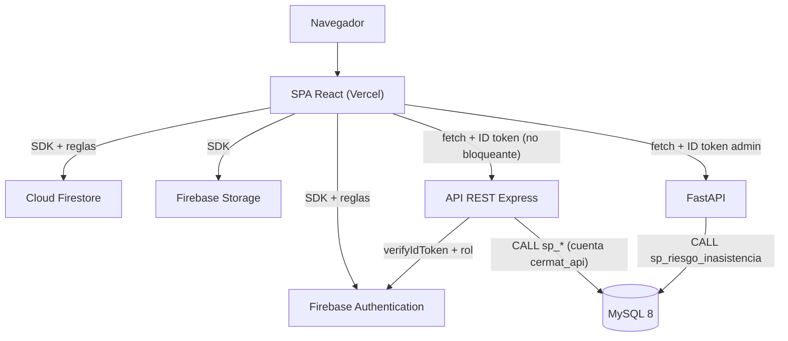

# E3 - Sistema de Software Funcional Integrado (CE023)

!!! abstract "Evidencia CE023 — Programación"
    Sistema funcional y desplegado que implementa los requerimientos del [E1](e1-definicion-sistema-ce021.md) sobre la plataforma de datos del [E2](e2-base-datos-ce022.md): una aplicación web React + TypeScript integrada con Firebase, una API REST Node.js y un servicio de analítica en Python.

## Portada

| Campo | Detalle |
|---|---|
| Título del sistema | Plataforma Web Integral de Gestión Académica CERMAT |
| Estudiantes | David Robert Yucra Mamani (líder), Gladys Rosaura Yana Pari, Denilson Leeke Mamani Flores, Cárdenas Vilca Rennzo |
| Semestre | 2026-2 (9° ciclo) |
| Fecha | 2026-10-24 |
| Despliegue | [https://academia-school-platform.vercel.app](https://academia-school-platform.vercel.app) (Vercel) |
| Repositorio | `github.com/yucradavid/academia-school-platform` (privado; acceso para el jurado a solicitud) |

## Resumen Ejecutivo

**Qué resuelve.** La plataforma centraliza la operación de la academia en un solo sistema con portales por rol: oferta de ciclos, pre-matrícula en línea, aprobación y pagos, asistencia por QR y consulta de los padres. Antes había registros dispersos, duplicados y riesgo de sobrepasar los cupos.

**Cómo se usa.**

1. El visitante elige un ciclo y se pre-matricula en `/matricula`.
2. El administrador aprueba la matrícula y registra el pago en `/admin/matriculas` y `/admin/pagos`. El alumno recibe un enlace de activación.
3. El auxiliar registra la entrada y salida escaneando el QR firmado del alumno.
4. El docente marca su asistencia con el QR del día.
5. El padre consulta la asistencia con un código `CERMAT-XXXX-XXXX` en `/consulta-asistencia`.

**Estado.** El sistema está desplegado y en operación piloto. Al 2026-10-24 tiene 8 matrículas, 2 pagos, 7 marcas de asistencia y 8 usuarios con perfil.

La verificación de esa fecha da:

- **TypeScript:** 0 errores (`tsc --noEmit`).
- **Build:** de producción correcto.
- **Pruebas:** 99 automáticas, todas en verde.
- **Calidad:** pipeline de CI con 6 trabajos (ver [E4](e4-calidad-operacion-ce024.md)).

## Sección 1: Arquitectura e Integración

### 1.1 Arquitectura general

| Proceso | Tecnología | Ubicación en el repositorio | Rol |
|---|---|---|---|
| Frontend SPA | React 18 + TypeScript + Vite | `src/` | Portales público y privados (55 rutas, 6 guardas) |
| Identidad y datos | Firebase Auth, Cloud Firestore, Storage | `src/lib/firebase.ts`, `firestore.rules` | Fuente de verdad, protegida por reglas probadas |
| API REST | Node.js + Express + TypeScript | `server/src/` | Sincronización a MySQL con autorización por rol |
| Analítica | Python + FastAPI | `analytics/main.py` | Riesgo de inasistencia y resúmenes (solo admin) |
| Base relacional | MySQL 8 | `server/src/db/` | Réplica con procedimientos, triggers y auditoría |

Desde el 2026-10-24 la API, la analítica y MySQL corren en el VPS del colegio. Nginx publica la API y la analítica por HTTPS en `api-academia.cermatschool.edu.pe` y `analitica-academia.cermatschool.edu.pe`, y la SPA las encuentra por esas direcciones, configuradas en el panel de administración (`config/services`).


```mermaid
flowchart TD
  Browser["Navegador"] --> SPA["SPA React (Vercel)"]
  SPA -->|"SDK + reglas"| Auth["Firebase Authentication"]
  SPA -->|"SDK + reglas"| FS["Cloud Firestore"]
  SPA -->|"SDK"| Storage["Firebase Storage"]
  SPA -->|"fetch + ID token (no bloqueante)"| API["API REST Express"]
  API -->|"verifyIdToken + rol"| Auth
  API -->|"CALL sp_* (cuenta cermat_api)"| MySQL[("MySQL 8")]
  SPA -->|"fetch + ID token admin"| Analytics["FastAPI"]
  Analytics -->|"CALL sp_riesgo_inasistencia"| MySQL
```

### 1.2 Capas, módulos y servicios

| Capa | Contenido | Ejemplos |
|---|---|---|
| Presentación | Páginas por portal y componentes de UI | `pages/admin/*`, `pages/student/*`, `components/ui/*` (shadcn/ui) |
| Dominio | 13 módulos con el mismo patrón de 4 archivos | `features/enrollments`, `payments`, `attendance`, `cycles`, `groups`, `users`, `teacherInvites`, `resources`, `posts`, `workshops`, `analytics`, `students`, `site` |
| Infraestructura | Acceso a Firebase y sincronización | `lib/firebase.ts`, `lib/syncService.ts` |
| Seguridad | Guardas de ruta y reglas del servidor | `routes/*Route.tsx`, `firestore.rules`, `server/src/middleware/auth.ts` |

### 1.3 Integración con la base de datos

- **Firestore** es la base operativa. Las escrituras críticas usan transacciones, como la matrícula con su cupo y el estado diario de la asistencia.
- **MySQL** recibe una copia de cada matrícula, pago y marca de asistencia mediante `syncService` → API → procedimiento almacenado. La cuenta de la API solo puede ejecutar procedimientos; no tiene INSERT, UPDATE ni DELETE directos.
- La sincronización es **idempotente**: reenviar un log no lo duplica. Además, **no bloquea**: si la API está apagada, el usuario no lo nota. La vista `v_conciliacion_pagos` detecta los eventos perdidos. Un envío fallido no se reintenta: llega solo cuando el registro vuelve a cambiar (PB-19 del [E4](e4-calidad-operacion-ce024.md)).
- Los datos anteriores a la sincronización se copiaron una sola vez el 2026-10-24 con `server/src/scripts/cargaInicial.ts`. Usa las mismas validaciones (`server/src/sync/esquemas.ts`) y los mismos procedimientos que `/api/sync`, y calcula la hora de Perú aunque el VPS esté en UTC ([E2 §2.3](e2-base-datos-ce022.md#23-evidencias-de-creacion)).

### 1.4 Integración con servicios externos

| Servicio | Uso | Autenticación |
|---|---|---|
| Firebase Authentication | Identidad de los 5 roles | Correo y contraseña; claims `admin` y `role` |
| Firebase Admin SDK (API y analítica) | Verificar el ID token y leer el rol | Cuenta de servicio |
| Vercel | Publicación del frontend | Panel del equipo |
| Sitio del colegio (cermatschool.edu.pe) | Enlaza a la plataforma de la academia | — (enlace público) |

## Sección 2: Funcionalidad del Sistema

### 2.1 Flujos principales implementados

| Flujo | Descripción | Evidencia |
|---|---|---|
| Pre-matrícula pública con cupo | Transacción con id determinístico, validación del ciclo, el grupo y el cupo, y mensaje claro ante un duplicado | `features/enrollments/api.ts` (`createEnrollment`); 6 pruebas de reglas con el código real |
| Máquina de estados de la matrícula | Pendiente → pagado (invitado) → pagado (activo); cancelación y reapertura con autor | `updateEnrollmentStatus`, `isAdminEnrollmentUpdateAllowed` |
| Pagos con cuotas | Registro solo admin, anulación lógica y saldo calculado | `features/payments/*`; reglas y triggers con pruebas |
| Activación por invitación | Token de un solo uso con vencimiento para estudiantes, docentes y auxiliares | `pages/Activate*Page.tsx`; 8 pruebas de roles |
| Asistencia con QR firmado | QR permanente del alumno con firma opaca y estado diario transaccional | `features/attendance/api.ts`, `studentQr.ts` |
| Asistencia del docente | QR diario con token de entrada y salida y ventana de validez; no se acepta salida sin entrada | `logTeacherAttendanceScan` |
| Consulta de padres | Código normalizado, sin caracteres ambiguos y revocable | `pages/ConsultaAsistenciaPadrePage.tsx`, `lib/parentAccess.ts` |
| Carga masiva por Excel | Alta de alumnos, docentes y auxiliares; los errores se reportan por fila sin detener el lote | `lib/excelImport.ts` |
| Analítica protegida | Riesgo de inasistencia sobre días lectivos, solo para administradores | `analytics/main.py`, `sp_riesgo_inasistencia` |

### 2.2 Gestión de usuarios, permisos y roles

| Rol | Cómo se identifica | Guarda de ruta | Alcance |
|---|---|---|---|
| Administrador | Claim `admin` | `AdminRoute` | Gestión completa, pagos y estados |
| Docente | Claim `teacher` o rol en `users` | `TeacherRoute` | Sus grupos, alumnos, recursos y asistencia propia |
| Auxiliar | Claim `auxiliar` o rol en `users`, creado solo con invitación | `AuxiliarRoute` | Paneles de escaneo de asistencia |
| Estudiante | Rol `student` | `StudentRoute` | Sus cursos, recursos, matrícula y asistencia |
| Padre | Código de acceso, sin cuenta | `ParentAttendanceRoute` | Asistencia de su hijo, solo lectura |
| Visitante | Sin sesión | — | Oferta pública y pre-matrícula |

### 2.3 Evidencias funcionales

| Pre-matrícula | Consulta de padres |
|---|---|
|  |  |

Más capturas (inicio, ciclos, ingreso y vista móvil) en la [Sección 2 del E1](e1-definicion-sistema-ce021.md#22-pantallas-principales).

!!! note "Capturas a adjuntar por el equipo"
    Portales con sesión: panel admin (matrículas y pagos), escaneo de QR por el auxiliar y portal del alumno. Requieren cuentas reales y no se capturaron de forma automatizada.

## Sección 3: Código y Diseño Técnico

### 3.1 Estructura del repositorio

```text
academia-school-platform/
├─ src/
│  ├─ features/<dominio>/   api.ts · hooks.ts · schemas.ts · types.ts · components/
│  ├─ pages/                55 rutas (público, admin, teacher, student, auxiliar)
│  ├─ components/           UI compartida (shadcn/ui) y layout
│  ├─ lib/                  firebase, syncService, qrPayload, parentAccess, date, excelImport
│  └─ routes/               guardas por rol
├─ server/                  API REST (src/routes, src/middleware, src/db, src/sync, src/scripts, scripts, test)
├─ analytics/               servicio FastAPI
├─ tests/firestore-rules/   pruebas de reglas con emulador
├─ firestore.rules · firebase.json
└─ .github/workflows/ci.yml · .github/pull_request_template.md
```

### 3.2 Patrones y buenas prácticas aplicadas

| Patrón | Propósito | Ejemplo |
|---|---|---|
| Módulo por dominio (4 archivos) | Navegación predecible y aislamiento | `features/enrollments/*` |
| Hooks de TanStack Query | Caché, estados de carga y error | `useCreatePost`, `useQuickEnrollmentSubmit` |
| Validación en la frontera (doble) | El cliente valida con Zod; el servidor revalida con reglas y Zod | `schemas.ts` + `firestore.rules` + `server/src/sync/esquemas.ts` (los mismos esquemas en `/api/sync` y en la carga inicial) |
| Id determinístico y transacciones | Evitar duplicados y condiciones de carrera sin bloqueos externos | `grupo__teléfono`, `attendanceDayState/{tipo}_{id}_{fecha}` |
| Escritura solo por procedimientos | Integridad y auditoría centralizadas en la base | `CALL sp_sync_pago(...)` |
| Idempotencia | Reintentos seguros de la sincronización y de la carga inicial | `sp_registrar_asistencia` |
| Invitación por token hasheado | Activar sin contraseñas compartidas; el token no se guarda | `sha256Hex(token)` como id |
| Utilidades genéricas | Un solo parser de Excel para 3 roles | `excelImport.ts`, `runBulkRows` |

### 3.3 Modularidad y desacoplamiento

- Las páginas no llaman directamente a Firebase: usan los hooks y la API de su dominio.
- La sincronización está aislada en `syncService` y se activa por configuración (`config/services`), sin recompilar.
- La API depende de una interfaz mínima de base de datos (procedimientos), no del esquema de tablas.

### 3.4 Manejo de errores y validaciones

| Situación | Tratamiento |
|---|---|
| Formulario inválido | Zod + react-hook-form muestran el error por campo antes de cualquier escritura |
| Operación remota fallida | Las mutaciones exponen `isError` y la UI notifica con un toast |
| Duplicado en la pre-matrícula pública | El permiso denegado se traduce a un mensaje comprensible (`createEnrollment`) |
| API: datos inválidos, rechazo de la base o error inesperado | 400 con detalle de Zod / 422 con el mensaje del trigger / 500 sin filtrar detalles internos |
| La llamada a un procedimiento falla | La API cierra esa conexión en vez de devolverla al pool, y MySQL deshace la transacción que el error pudo dejar abierta (`ejecutar` en `server/src/db/mysql.ts`) |
| Carga masiva | Continúa ante errores por fila e informa la fila real del Excel |
| Fechas de Firestore | `toDateSafe` convierte `Timestamp`, `Date` o texto, sin "Invalid Date" |

**Correcciones de esta iteración (2026-10-24):**

| Defecto | Corrección |
|---|---|
| 66 errores de TypeScript | Tipos corregidos sin cambiar el JavaScript generado (verificado archivo por archivo); 0 errores |
| Fechas del blog como "Invalid Date" | `toDateSafe` con 3 pruebas |
| Guardar un post sin imagen fallaba (`undefined` en Firestore) | Se guarda una cadena vacía |
| Editar un post reiniciaba su fecha de publicación | La API fija la fecha solo en la primera publicación |
| Posts sin autor | Se registra `createdBy` con el UID del administrador |
| Sincronización con `alumnoId` vacío | Se usa `studentUid`, que es el vínculo real |
| Animación de entrada de la galería que nunca corría | Entrada y hover separados en dos elementos (verificado en el navegador) |
| Ejemplo de código de padres inválido (`…AB12…` contiene "1") | Ejemplo válido `CERMAT-AB2C-D3EF` |
| Toda sincronización con turno mañana respondía 500 (`Data truncated`) | Migración `05_corregir_turno.sql` y `SET NAMES utf8mb4` en los scripts SQL |
| En el VPS, la asistencia, las funciones de saldo y `sp_estado_cuenta` fallaban con `Illegal mix of collations` | Base en `utf8mb4_0900_ai_ci` y rutinas re-creadas; `restore.js` verifica la collation |
| Una sincronización fallida dejaba su transacción abierta y bloqueó una migración | La API cierra la conexión si la llamada falla; la analítica cierra siempre la suya |

## Sección 4: Despliegue o Instalación

### 4.1 Instrucciones de instalación

| Componente | Pasos |
|---|---|
| Frontend | `npm install` · `npm run dev` (desarrollo) · `npm run build` (genera `dist/`) |
| Calidad | `npm run typecheck` · `npm test` · `npm run test:rules` (emulador de Firestore; requiere Java y Firebase CLI) |
| Reglas de Firestore | `firebase deploy --only firestore:rules` (o automático desde el CI) |
| API REST | `cd server && npm install && npm run build` y PM2 (en el VPS, como `academia`: `pm2 start dist/index.js --name academia-api`) · pruebas: `npm test` |
| Base MySQL | Migraciones `02`–`05` y cuentas de mínimo privilegio según `server/src/db/README.md` |
| Analítica | `pip install -r requirements.txt` · `uvicorn main:app --host 127.0.0.1 --port 8000` (en el VPS, con PM2) |

El despliegue en el VPS del colegio está documentado paso a paso en `deploy/MANUAL-DESPLIEGUE-CERMAT.md` del repositorio de la plataforma: usuario de servicio, PM2, Nginx, HTTPS, respaldo diario y verificación.

**Orden obligatorio al actualizar:**

1. Publicar el frontend.
2. Publicar las reglas: las nuevas exigen la invitación que solo envía el frontend nuevo.
3. Aplicar las migraciones de MySQL, con la API y la analítica detenidas.
4. Reiniciar la API y la analítica, que ya llaman a los procedimientos almacenados.

Los cuatro pasos se cumplieron en este orden el 2026-10-24. Los pasos 1 y 2 se verificaron en producción ([E4 §2.7](e4-calidad-operacion-ce024.md#27-cierre-en-produccion-2026-10-24)). Los pasos 3 y 4 se hicieron entre las 16:29 y las 16:40 (UTC−5): migraciones en la base real con respaldo previo, y la API y la analítica en línea con PM2, cada una con su cuenta de mínimo privilegio ([E2 §2.3](e2-base-datos-ce022.md#23-evidencias-de-creacion)). Después de cada publicación se verifica la versión en producción (bundle y cabeceras), porque Vercel puede bloquear un despliegue sin que el push lo muestre. Esa misma noche la capa relacional pasó al VPS del colegio. La migración 05 y la corrección de la collation se aplicaron allí a las 22:06, con los servicios detenidos, y la prueba de punta a punta de las 22:10 y 22:11 dio 200 ([E4 §2.8](e4-calidad-operacion-ce024.md#28-analisis-del-incidente-sincronizacion-con-el-vps-inc-06)).

### 4.2 Configuración requerida (solo nombres de variables)

| Componente | Variables |
|---|---|
| Frontend | `VITE_FIREBASE_API_KEY`, `VITE_FIREBASE_AUTH_DOMAIN`, `VITE_FIREBASE_PROJECT_ID`, `VITE_FIREBASE_STORAGE_BUCKET`, `VITE_FIREBASE_MESSAGING_SENDER_ID`, `VITE_FIREBASE_APP_ID` |
| API | `MYSQL_HOST`, `MYSQL_PORT`, `MYSQL_USER` (`cermat_api`), `MYSQL_PASSWORD`, `MYSQL_DATABASE`, `FIREBASE_PROJECT_ID`, `GOOGLE_APPLICATION_CREDENTIALS`, `CORS_ORIGINS` (incluye el dominio de Vercel), `HOST` (127.0.0.1 en el VPS) y `TRUST_PROXY` (`loopback`, detrás de Nginx) |
| Analítica | `MYSQL_*` (`cermat_analitica`), `ALLOWED_ORIGINS`, `FIREBASE_SERVICE_ACCOUNT_PATH` |
| Respaldo | `BACKUP_MYSQL_USER` (`cermat_respaldo`), `BACKUP_MYSQL_PASSWORD`, `RESTORE_MYSQL_USER`, `MYSQLDUMP_PATH`, `MYSQL_PATH` |

Las contraseñas de MySQL van en `server/.env.local` y `analytics/.env.local`. No se versionan (regla `*.local`) y tienen prioridad sobre los `.env`, que siguen versionados sin contraseñas. En el VPS están en `/opt/academia/api/.env.local` y `/opt/academia/analitica/.env.local`, con permiso 600.

### 4.3 Evidencia de despliegue y ejecución

| Evidencia | Resultado |
|---|---|
| Frontend publicado | [academia-school-platform.vercel.app](https://academia-school-platform.vercel.app) responde 200 (capturas del 2026-10-24). Desde el 2026-10-24 producción corre la versión de esta iteración, con las cabeceras de seguridad ([E4 §2.7](e4-calidad-operacion-ce024.md#27-cierre-en-produccion-2026-10-24)). |
| Build de producción | `vite build` correcto (aviso de chunk mayor de 500 kB, registrado en el plan de mejora del E4) |
| Tipos | `tsc --noEmit` sin errores |
| Pruebas | 34 unitarias, 27 de API, 19 de reglas y 19 de base de datos: 99 en verde |
| Respaldo y restauración | Restauración verificada con SHA-256: RTO de 0,23 s en la base real (REC-05) y de 0,27 s en la base de prueba; en otro servidor, 0,33 s en el VPS (REC-13) y 0,41 s del VPS a la PC (REC-14) ([E2](e2-base-datos-ce022.md)) |
| Capa relacional en el VPS | `https://api-academia.cermatschool.edu.pe/health` y `https://analitica-academia.cermatschool.edu.pe/health` responden `"status":"ok"` con MySQL conectado; sincronización de punta a punta con respuesta 200 (2026-10-24, 22:10 y 22:11) |
| Respaldo diario | Temporizador de systemd en el VPS, a las 03:00 de Perú; primera ejecución correcta el 2026-10-24 a las 22:18 |
| Carga inicial de la réplica | 2026-10-24, 22:56: 10 matrículas (0 provisionales), 2 pagos y 7 asistencias en el MySQL del VPS, sin rechazos ni errores ([E2 §2.3](e2-base-datos-ce022.md#23-evidencias-de-creacion)) |
| Capturas del despliegue | 18 capturas del 2026-10-24, con los datos personales tapados ([Evidencias del despliegue](infraestructura/evidencias-despliegue-2026-10-24.md)) |

## Anexos

| Anexo | Ubicación |
|---|---|
| Repositorio fuente | `github.com/yucradavid/academia-school-platform` |
| Manual técnico breve | Sección 4 de este documento y `server/src/db/README.md` |
| Capturas de funcionamiento | `docs/assets/capturas/` (6 capturas del sitio desplegado) y [18 capturas del despliegue del 2026-10-24](infraestructura/evidencias-despliegue-2026-10-24.md) |
| Evidencia de despliegue | URL de Vercel, `vercel.json`, `firebase.json`, `.github/workflows/ci.yml` |
| Evidencia de sustentación | Pendiente (ver [Guía de sustentación](e5-presentacion-sustentacion-ce0217.md)) |

## Rúbrica de Evaluación

| Criterio | Excelente | Bueno | Regular | Deficiente |
|---|---|---|---|---|
| Arquitectura e integración del sistema | Arquitectura clara e integración completa | Integración funcional | Integración parcial | Sin integración |
| Funcionalidad del sistema | Sistema completamente operativo | Funcionalidad mayormente correcta | Funcionalidad incompleta | No cumple requerimientos |
| Integración entre capas y servicios | Comunicación fluida entre componentes | Integración funcional | Integración parcial | Componentes aislados |
| Calidad del código | Código limpio y modular | Código estructurado | Código poco organizado | Código deficiente |
| Desempeño y comportamiento del sistema | Sistema eficiente | Rendimiento aceptable | Problemas de rendimiento | Sistema inestable |
| Escalabilidad y diseño técnico | Diseño preparado para escalar | Escalabilidad parcial | Diseño rígido | No escalable |
| Sustentación y defensa técnica | Explica y defiende con dominio las decisiones tomadas | Explica con solvencia | Explica con dificultad | No sustenta |
