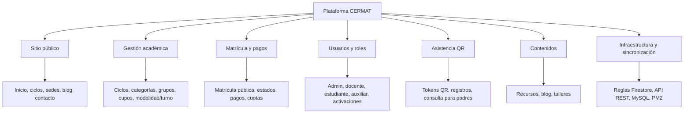
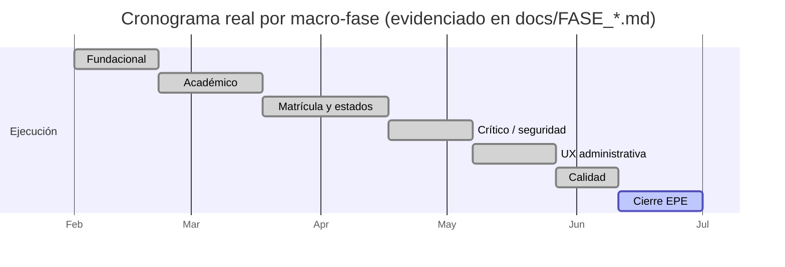

# Entregable 3: Plan de Gestión del Proyecto (CE0121-CE0125)

## Portada

| Campo | Detalle |
|---|---|
| Título | Plan de gestión del proyecto — Plataforma CERMAT |
| Competencia | CE012 — Gestión de Proyectos |
| Enfoque | Ágil iterativo (evidencia real en el historial de fases del repositorio) |
| Integrantes | David Robert Yucra Mamani (líder), Gladys Rosaura Yana Pari, Denilson Leeke Mamani Flores, Cárdenas Vilca Rennzo |
| Ciclo académico | 9° ciclo |
| Fecha | 2026-07-06 |

## 3.1 Acta de constitución

| Campo | Detalle |
|---|---|
| Sponsor | Dirección de Academia La Prepa Cermat |
| Objetivo | Ver objetivos SMART en el [Business Case](e2-business-case-ce0113.md#21-justificacion-del-proyecto) |
| Alcance preliminar | Plataforma web integral: sitio público, matrícula, ciclos/grupos/sedes, pagos, asistencia QR, portales por rol, recursos/blog/talleres, sincronización complementaria — detallado en el [Brief EPE — Alcance](../brief-epe.md#5-alcance) |
| Restricciones | Equipo de desarrollo reducido; presupuesto de una academia privada mediana; sin pasarela de pagos automatizada ni app móvil nativa en esta fase (ver "No incluye" del Brief EPE) |
| Supuestos | Los administradores institucionales validan reglas de negocio (matrícula, pagos, activaciones); Firestore es la fuente principal de datos operativos |

## 3.2 Gestión del alcance (EDT / WBS)

**Diccionario de entregables (resumen):** cada rama de la EDT corresponde a uno o más `features/*` del repositorio (ver [Evidencia técnica base del índice](../index.md#evidencia-tecnica-base)), con su propio esquema de datos, hooks de acceso, y páginas de administración/público.

## 3.3 Gestión del cronograma

El proyecto se ejecutó de forma **iterativa**, no en una única entrega: el repositorio conserva más de 90 documentos de fase y auditoría (`docs/FASE_*.md`, `docs/AUDITORIA_*.md`) que registran cada iteración real, en orden cronológico verificable por control de versiones. Hitos principales (macro-fases):

| Hito | Contenido representativo |
|---|---|
| Fundacional | Home público, header/navegación, hero, footer (fases `FASE_A` a `FASE_H2`) |
| Académico | Ciclos, grupos, sedes, categorías, modalidad/turno (fases `FASE_ACADEMICO_*`) |
| Matrícula y estados | Máquina de estados de matrícula, cupos, activación de alumno (fases `FASE_R1` a `FASE_R5`) |
| Crítico/seguridad | Reglas de Firestore, deduplicación, payload de matrícula (fases `FASE_CRITICA_*`) |
| UX administrativa | Sidebar responsivo, formularios en panel, KPIs de matrícula/pagos (fases `FASE_UIX_*`) |
| Calidad | Higiene de lint, tipado seguro, auditoría global (fases `FASE_H2_*`) |
| Cierre EPE | Este perfil de egreso (Brief + E1-E5 de CE02 + CE01 + CE03) |

**Lista de actividades por hito:**

- **Fundacional:** estructurar layout base (header, footer, navegación) → construir home pública → conectar secciones informativas (ciclos, sedes).
- **Académico:** modelar ciclos/grupos/sedes en Firestore → construir panel de administración académica → habilitar categorías, modalidad y turno.
- **Matrícula y estados:** diseñar máquina de estados de matrícula → implementar validación de cupo → conectar pre-matrícula pública con aprobación administrativa.
- **Crítico/seguridad:** endurecer reglas de Firestore por rol → implementar deduplicación de matrículas → auditar el payload de matrícula contra condiciones de carrera.
- **UX administrativa:** rediseñar sidebar responsivo → migrar formularios clave del panel → construir KPIs de matrícula y pagos.
- **Calidad:** ejecutar auditoría global de lint/tipado → documentar deuda técnica conocida → cerrar advertencias priorizadas.
- **Cierre EPE:** redactar Brief + entregables CE01/CE02/CE03 → generar diagramas y PDF exportable → preparar sustentación.

**Cronograma (vista Gantt, macro-fases sobre el ciclo académico):**

*(Fechas aproximadas para fines de visualización del cronograma; la evidencia verificable y cronológica real está en el historial de commits y en `docs/FASE_*.md`.)*

## 3.4 Gestión de costos

**Línea base de costos del proyecto** (adaptada del [Business Case — Estimación de costos](e2-business-case-ce0113.md#24-estimacion-de-costos) como presupuesto propio de este plan):

| Partida | Peso relativo | Detalle |
|---|---|---|
| Desarrollo (equipo propio) | ~70% | Horas de desarrollo distribuidas en las 7 macro-fases del cronograma; sin licencias de software (stack de código abierto). |
| Servicios cloud variables (Firebase) | ~15% | Firestore, Storage y Authentication, facturados según uso real, no por licencia fija. |
| Infraestructura local (línea CE03) | ~10% | Servidor local, UPS y conectividad de respaldo — ver [Diseño de Centro de Datos](../infraestructura/e3-diseno-centro-datos-ce0331.md#seccion-3-dimensionamiento-de-capacidad). |
| Mantenimiento y evolución continua | ~5% | Horas de soporte, auditorías incrementales (`docs/AUDITORIA_*.md`) y corrección de deuda técnica. |

No se maneja un presupuesto de terceros/consultoría externa: el costo principal es el tiempo de desarrollo del equipo propio, no un desembolso monetario directo de la institución más allá del uso variable de servicios cloud. Los pesos relativos son estimaciones para fines de sustentación, consistentes con las cifras del Business Case, no un presupuesto contable formal.

## 3.5 Gestión de riesgos

| Riesgo | Probabilidad | Impacto | Respuesta |
|---|---|---|---|
| Cambios de alcance no controlados (nuevos módulos solicitados a mitad de iteración) | Media | Medio | Se documenta cada fase como una unidad cerrada (`FASE_*.md`) antes de iniciar la siguiente. |
| Regresiones al modificar reglas de seguridad de Firestore | Media | Alto | Verificación manual y documentada antes de publicar cambios (ver [E4 — Calidad, Operación y Evolución](../e4-calidad-operacion-ce024.md)). |
| Deuda técnica acumulada por iteración rápida | Media | Medio | Fases dedicadas de "higiene" y auditoría global (`FASE_H2_*`) para pagar deuda técnica periódicamente. |

## 3.6 Gestión ágil

El proyecto **no siguió Scrum formal con sprints de calendario fijo**, sino un enfoque ágil iterativo basado en fases temáticas cerradas (equivalente funcional a un backlog priorizado por dominio): cada `FASE_*` es, en la práctica, un incremento entregado y documentado antes de iniciar el siguiente. Esta forma de trabajo es honesta con cómo se construyó realmente el sistema, en vez de forzar una notación Scrum que no se usó.

## Rúbricas

| Criterio | Excelente | Bueno | Regular | Deficiente |
|---|---|---|---|---|
| Acta de Constitución | Formula acta completa con objetivos SMART, justificación estratégica, stakeholders identificados y criterios de éxito definidos. | Define objetivos, alcance preliminar y stakeholders de forma clara. | Presenta acta con información general y poco precisa. | No define formalmente el proyecto ni sus objetivos. |
| Gestión del Alcance | Define alcance detallado con EDT estructurada, diccionario de trabajo y control de cambios establecido. | Presenta EDT/WBS coherente con entregables definidos. | Define alcance general sin desglose estructurado. | No delimita entregables ni estructura de trabajo. |
| Gestión del Cronograma | Presenta cronograma detallado, secuenciado, con dependencias, hitos críticos y coherencia total con el alcance. | Presenta cronograma estructurado con actividades y hitos definidos. | Presenta cronograma básico sin coherencia total con el alcance. | No presenta planificación temporal clara. |
| Gestión de Costos | Desarrolla presupuesto detallado con línea base de costos, estimaciones justificadas y control presupuestal definido. | Presenta presupuesto coherente alineado al alcance y cronograma. | Presenta estimación general sin estructura presupuestal clara. | No estima costos o lo hace de manera informal. |
| Gestión de Riesgos | Desarrolla matriz completa con evaluación cualitativa, priorización y plan formal de respuesta y seguimiento. | Presenta matriz de riesgos con análisis básico de probabilidad e impacto. | Enumera riesgos sin análisis estructurado. | No identifica riesgos relevantes. |
| Gestión Ágil (si aplica) | Integra marco ágil coherente (backlog priorizado, sprints definidos, criterios de aceptación y métricas de seguimiento). | Define backlog, iteraciones y entregables incrementales. | Menciona prácticas ágiles sin estructura clara. | No aplica prácticas ágiles cuando corresponde. |
