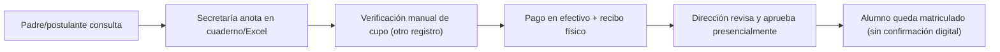
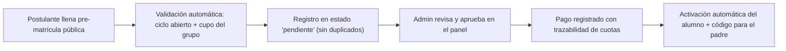

# Entregable 4: Modelado de Procesos AS-IS / TO-BE (CE0131-CE0135)

## Portada

| Campo | Detalle |
|---|---|
| Título | Modelado de procesos: matrícula académica — Academia La Prepa Cermat |
| Competencia | CE013 — Gestión de Procesos |
| Proceso analizado | Matrícula de un alumno a un ciclo/grupo |
| Integrantes | David Robert Yucra Mamani (líder), Gladys Rosaura Yana Pari, Denilson Leeke Mamani Flores, Cárdenas Vilca Rennzo |
| Ciclo académico | 9° ciclo |
| Fecha | 2026-07-06 |

Se elige el proceso de **matrícula** por ser el de mayor impacto directo en el problema declarado en el [Diagnóstico Organizacional](e1-diagnostico-organizacional-ce0111.md#14-identificacion-del-problema): duplicidad de datos, riesgo de errores en cupos y demora en la atención.

## 4.1 Proceso actual (AS-IS)

**Descripción narrativa (antes de la plataforma):** el padre/postulante se acerca o llama a secretaría; se anota su interés en un cuaderno o Excel local; secretaría verifica manualmente, revisando otro registro aparte, si el grupo/turno tiene cupo; el pago se recibe en efectivo con recibo físico, sin vínculo automático al registro de matrícula; la aprobación final depende de que dirección revise el caso de forma presencial; no existe confirmación digital inmediata para el padre.

**Indicadores actuales (estimados):** tiempo entre consulta inicial y confirmación de matrícula: de 1 a varios días; canal de confirmación al padre: ninguno formal (verbal/telefónico).

**Problemas detectados:** duplicidad de registros de un mismo alumno; riesgo real de matricular por encima del cupo del grupo (dos registros manuales pueden desincronizarse); pago desconectado del estado de matrícula; nula trazabilidad para auditoría posterior.

## 4.2 Proceso propuesto (TO-BE)

**Rediseño del flujo:** el postulante completa la pre-matrícula pública (`/matricula`); el sistema valida en el momento que el ciclo esté abierto y que el grupo elegido tenga cupo disponible; se crea el registro con estado `pendiente`; el administrador revisa y aprueba desde el panel; al aprobar, se registra el pago con trazabilidad de cuotas, se genera automáticamente el acceso/activación del alumno y el código de consulta de asistencia para el padre.

**Automatizaciones incorporadas:** validación transaccional de cupo de grupo (evita sobre-matrícula por condiciones de carrera), deduplicación de matrículas por alumno/ciclo, generación automática del enlace de activación y del código de consulta de asistencia — evidencia técnica de estas automatizaciones en `src/features/enrollments/*` y en el historial `docs/FASE_R5_*` y `docs/AUDITORIA_CRITICA_3_DEDUPLICACION_ENROLLMENTS.md` del repositorio.

**Nuevos indicadores propuestos:** tiempo entre pre-matrícula y aprobación (medible en minutos/horas, no días); porcentaje de matrículas aprobadas sin intervención telefónica; incidentes de sobre-cupo (meta: 0, garantizado por validación transaccional).

## 4.3 Análisis comparativo

| Dimensión | AS-IS | TO-BE | Mejora |
|---|---|---|---|
| Tiempo de confirmación | Horas a días | Minutos (validación y registro inmediatos) | Reducción drástica de tiempo de espera para el padre |
| Riesgo de sobre-cupo | Real (dos registros manuales pueden desincronizarse) | Eliminado (validación transaccional de cupo) | Mejora de calidad/confiabilidad |
| Trazabilidad de pagos | Desconectada del registro de matrícula | Vinculada 1:1 con la matrícula, con historial de cuotas | Mejora de calidad y auditoría |
| Canal de confirmación al padre | Ninguno formal | Automático (activación + código de asistencia) | Mejora de experiencia y reducción de llamadas a secretaría |

## Rúbricas

| Criterio | Excelente | Bueno | Regular | Deficiente |
|---|---|---|---|---|
| Modelado AS-IS | Modelado detallado con identificación clara de ineficiencias. | Modelado correcto del proceso actual. | Representación básica sin análisis crítico. | Incorrecto o incompleto. |
| Propuesta TO-BE | Rediseño innovador con mejora cuantificada en eficiencia y calidad. | Rediseño coherente apoyado en TIC. | Propone mejoras generales. | No responde al problema. |
| Análisis comparativo | Cuantifica mejoras en tiempo, costo y calidad. | Evidencia mejoras esperadas. | Comparación descriptiva básica. | No presenta comparación. |
