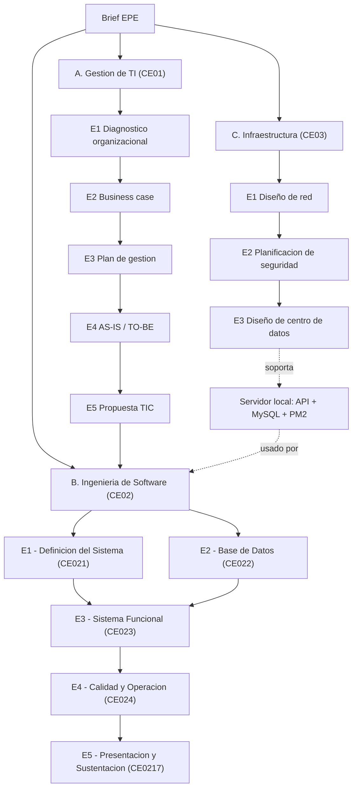

# Perfil de Egreso - Plataforma Web Integral CERMAT

!!! abstract "EPE — Sistema funcional en producción"
    Esta documentación organiza las evidencias del proyecto **Plataforma Web Integral de Gestión Académica CERMAT** bajo la estructura de Perfil de Egreso (**EPE**). El sistema no es un prototipo: está implementado, desplegado y operando con datos reales de la Academia Colegio CERMAT, Juliaca, Perú.

    Link del [Repositorio](https://github.com/yucradavid/Perfil-de-egreso-Plataforma-Web-Integral-CERMAT) 

## Presentacion

Esta documentacion organiza las evidencias del proyecto **Plataforma Web Integral de Gestion Academica CERMAT** bajo la estructura operativa de Perfil de Egreso (**EPE**) y las tres lineas de competencia de especialidad de la carrera:

- **CE01 - Gestion de Tecnologias de Informacion** (CE011 Gestion e Innovacion de TI, CE012 Gestion de Proyectos, CE013 Gestion de Procesos, CE014 Gestion de Sistemas de Informacion)
- **CE02 - Ingenieria de Software** (CE021 Requerimientos, CE022 Informacion, CE023 Programacion, CE024 Calidad)
- **CE03 - Infraestructura Tecnologica** (CE031 Conectividad, CE032 Seguridad de la Informacion, CE033 Centro de Datos)

El sistema documentado corresponde a una plataforma escolar web construida con **React, TypeScript, Vite, Firebase Authentication, Cloud Firestore, Firebase Storage, TanStack Query, Tailwind CSS y una API REST Node.js + MySQL opcional para sincronizacion operativa**.

## Proyecto

| Campo | Valor |
|---|---|
| Nombre | Plataforma Web Integral de Gestion Academica CERMAT |
| Tipo | EPE |
| Organizacion | Academia Colegio CERMAT |
| Fecha de documentacion | 2026-06-22 (actualizado 2026-07-05) |
| Alcance academico | Perfil de egreso completo: CE01 (Gestion de TI), CE02 (Ingenieria de Software) y CE03 (Infraestructura) |
| Base tecnica principal | SPA React + Firebase |
| Base de datos principal | Cloud Firestore |
| Base de datos complementaria | MySQL para reportes/sincronizacion operativa |

## Entregables incluidos

### A. Gestion de Tecnologias de Informacion (CE01)

| Entregable | Competencia | Descripcion |
|---|---|---|
| [E1 - Diagnostico Organizacional](gestion-ti/e1-diagnostico-organizacional-ce0111.md) | CE0111-CE0115 | Contexto, FODA, diagnostico digital e identificacion del problema. |
| [E2 - Business Case](gestion-ti/e2-business-case-ce0113.md) | CE0113 | Alternativas evaluadas, beneficios, costos y riesgos iniciales del proyecto. |
| [E3 - Plan de Gestion del Proyecto](gestion-ti/e3-plan-gestion-proyecto-ce0121.md) | CE0121-CE0125 | Acta de constitucion, EDT, cronograma real por fases, costos y riesgos. |
| [E4 - Modelado de Procesos AS-IS/TO-BE](gestion-ti/e4-modelado-procesos-ce0131.md) | CE0131-CE0135 | Rediseño del proceso de matricula, de manual a digital, con mejoras cuantificadas. |
| [E5 - Propuesta de Solucion TIC](gestion-ti/e5-propuesta-solucion-tic-ce0141.md) | CE0141-CE0145 | La plataforma como ecosistema de sistemas de informacion de la institucion. |

### B. Ingenieria de Software (CE02)

| Entregable | Competencia | Descripcion |
|---|---|---|
| Brief EPE | Punto de partida | Define problema, contexto, alcance, datos, solucion y viabilidad. |
| [E1 - Definicion del Sistema](e1-definicion-sistema-ce021.md) | CE021 | Integra requerimientos, prototipos, arquitectura, UML y trazabilidad. |
| [E2 - Base de Datos del Sistema](e2-base-datos-ce022.md) | CE022 | Documenta modelo de datos, esquema, consultas, seguridad, rendimiento y consistencia. |
| [E3 - Sistema Funcional Integrado](e3-sistema-funcional-ce023.md) | CE023 | Documenta arquitectura de integracion, funcionalidad implementada, diseño de codigo y despliegue. |
| [E4 - Calidad, Operacion y Evolucion](e4-calidad-operacion-ce024.md) | CE024 | Documenta pruebas, CI/CD, metricas tecnicas y auditoria/evolucion del sistema, con brechas declaradas. |
| [E5 - Presentacion, Video Pitch y Sustentacion Final](e5-presentacion-sustentacion-ce0217.md) | CE0217 | Guion de sustentacion y demo en vivo, con preguntas anticipadas del jurado y sintesis final del aporte del proyecto. |

### C. Infraestructura Tecnologica (CE03)

| Entregable | Competencia | Descripcion |
|---|---|---|
| [E1 - Diseño de Red](infraestructura/e1-diseno-red-ce0311.md) | CE0311 | Topologia, VLAN, redundancia y estandares de conectividad para la sede que aloja la capa local de la plataforma. |
| [E2 - Planificacion de Seguridad](infraestructura/e2-planificacion-seguridad-ce0321.md) | CE0321 | Activos criticos, analisis de riesgos ISO 27005/NIST, politicas y roles. |
| [E3 - Diseño de Centro de Datos](infraestructura/e3-diseno-centro-datos-ce0331.md) | CE0331 | Clasificacion Tier, layout fisico, dimensionamiento y virtualizacion/cloud hibrido. |
| [E4 - Implementacion y Testing de Red](infraestructura/e4-implementacion-testing-red-ce0312-ce0313.md) | CE0312-CE0313 | Configuracion de dispositivos, direccionamiento y protocolo de pruebas. |
| [E5 - Implementacion, Monitoreo y Etica](infraestructura/e5-implementacion-monitoreo-etica-ce0322-ce0324.md) | CE0322-CE0324 | Controles tecnicos, KPIs de seguridad y analisis etico ACM. |
| [E6 - Implementacion y Control de Centro de Datos](infraestructura/e6-implementacion-control-cd-ce0332-ce0333.md) | CE0332-CE0333 | Servicios del servidor local, respaldos, SLA y procedimientos operativos. |

## Resumen ejecutivo del sistema

!!! success "Métricas del sistema"
    | Indicador | Valor |
    |---|---|
    | Módulos de dominio implementados | 10+ (ciclos, grupos, matrículas, pagos, asistencia, recursos, posts, talleres, usuarios, analítica) |
    | Rutas protegidas por rol | 4 portales (admin, docente, estudiante, auxiliar) |
    | Colecciones Firestore documentadas | 21 (actualizado 2026-07-05; eran 16 el 2026-06-22) |
    | Tablas MySQL complementarias | 6 |
    | Requerimientos funcionales | 22 (RF01–RF22) |
    | Requerimientos no funcionales | 10 (RNF01–RNF10) |
    | Documentos de auditoria/evolucion (`docs/AUDITORIA_*`, `docs/FASE_*`) | 90+ |
    | Stack principal | React 18 + TypeScript + Firebase + Node.js + MySQL + Python (FastAPI) |

La plataforma CERMAT resuelve la gestion academica y administrativa de una institucion educativa que necesita centralizar su presencia publica, matriculas, ciclos, grupos, pagos, asistencia, recursos, docentes, estudiantes, auxiliares y comunicacion con padres.

El producto no se limita a una pagina informativa. Opera como una plataforma educativa con portales diferenciados:

- Portal publico para informacion institucional, ciclos, sedes, recursos, talleres, blog, contacto y matricula.
- Portal administrativo para configuracion academica, matriculas, pagos, alumnos, docentes, auxiliares, asistencia, contenidos y talleres.
- Portal docente para cursos, recursos y control de asistencia.
- Portal estudiante para cursos, recursos, matricula, asistencia y talleres.
- Portal auxiliar para supervision de asistencia.
- Consulta publica de asistencia para padres mediante codigo CERMAT.

## Mapa de documentacion

## Arquitectura de la solucion

!!! tip "Arquitectura técnica híbrida"
    La solución combina una capa **cloud** (Firebase) para operación web en tiempo real y una capa **local** (Node.js + MySQL + Python FastAPI) para analítica, alertas automáticas y respaldo. La imagen de arquitectura completa se incluye en el Brief EPE y el E1.

    | Capa | Tecnología | Rol |
    |---|---|---|
    | Presentación | React 18 + TypeScript + Vite | SPA multi-portal por rol |
    | Autenticación | Firebase Authentication | Identidad y claims |
    | Datos cloud | Cloud Firestore + Storage | Base operativa principal |
    | API REST | Node.js + Express | Sincronización y auditoría |
    | Analítica | Python + FastAPI | Alertas y tendencias |
    | Datos local | MySQL | Reportes y respaldo relacional |
    | Infraestructura | PM2 + backups automáticos | Gestión de servicios locales |

## Evidencia tecnica base

| Evidencia | Archivo / ubicacion |
|---|---|
| Rutas y modulos activos | `src/App.tsx` |
| Inventario funcional | `MODULOS_ACTIVOS_WEB.md` |
| Configuracion Firebase | `src/lib/firebase.ts` |
| Reglas de seguridad Firestore | `firestore.rules` |
| Matriculas | `src/features/enrollments/*` |
| Ciclos academicos | `src/features/cycles/*` |
| Grupos | `src/features/groups/*` |
| Pagos | `src/features/payments/*` |
| Asistencia | `src/features/attendance/*` |
| Usuarios y roles | `src/features/users/*`, `src/routes/*` |
| Sincronizacion API REST | `src/lib/syncService.ts`, `server/src/*` |
| Esquema MySQL | `server/src/db/schema.sql` |
| Servicio de analitica | `analytics/main.py` |
| Invitaciones y activacion por rol | `src/features/teacherInvites/*`, `src/pages/Activate*Page.tsx` |
| Carga masiva por Excel | `src/lib/excelImport.ts`, `src/components/admin/ExcelUploadButton.tsx` |
| Auditorias y evolucion tecnica | `docs/AUDITORIA_*.md`, `docs/FASE_*.md` |
| Metricas de calidad de codigo | `lint-report.txt`, `lint-h2-1-before.txt`, `lint-h2-1-after.txt` |
