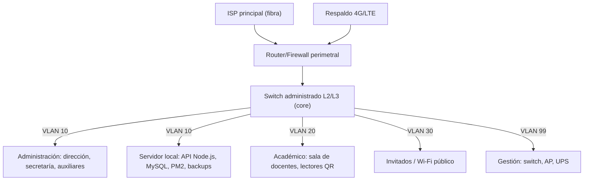

# Entregable 1: Diseño de Red (CE0311)

## Portada

| Campo | Detalle |
|---|---|
| Título | Diseño de red — Sede principal Academia Colegio CERMAT, Juliaca |
| Competencia | CE031 — Conectividad |
| Semestre | 1 |
| Fecha | 2026-07-06 |

## Resumen ejecutivo

La sede principal de Academia Colegio CERMAT concentra el personal administrativo (dirección, secretaría/admisión, auxiliares) y aloja el servidor local que sostiene la capa complementaria de la Plataforma CERMAT (API Node.js, MySQL, analítica Python, PM2). Este documento diseña la red de esa sede: separa por VLAN el tráfico administrativo, académico y de invitados; define un esquema de direccionamiento privado escalable; e incorpora redundancia de salida a internet para que la matrícula, el cobro de pagos y la sincronización con Firebase no dependan de un único enlace.

## Sección 1: Levantamiento de requerimientos

**Requerimientos técnicos**

| Requerimiento | Detalle |
|---|---|
| Usuarios concurrentes | ~12-18 equipos: dirección (1-2), secretaría/admisión (2-3), auxiliares (2-4), docentes en sala de profesores (hasta 6 simultáneos), servidor local (1). |
| Ancho de banda | Enlace principal ≥ 50 Mbps simétrico (suficiente para SPA en navegador + sincronización periódica hacia Firebase + backups nocturnos de MySQL). |
| Disponibilidad | La matrícula pública y el cobro de pagos no deben detenerse por una caída puntual del enlace principal (ver redundancia, sección 3). |
| Dispositivos | PCs/laptops administrativos, lector de código de barras/QR para asistencia, impresora de red, el servidor local (rack), access points Wi-Fi. |

**Requerimientos de negocio**

- Separar el tráfico **administrativo** (datos de matrícula, pagos, el servidor local) del tráfico de **invitados/Wi-Fi público**, para que un dispositivo de visita no pueda alcanzar el servidor ni los equipos de secretaría.
- Dar prioridad de red al tráfico hacia Firebase/Firestore (operación en tiempo real de la plataforma) frente a navegación general.
- Permitir que docentes conecten sus propios dispositivos para pasar asistencia por QR sin tener acceso a los sistemas administrativos.

## Sección 2: Diseño de topología

### Topología lógica

### Segmentación (VLAN, subnetting)

| VLAN | Nombre | Rango (RFC 1918) | Propósito |
|---|---|---|---|
| 10 | Administración | 10.10.10.0/24 | Dirección, secretaría, auxiliares y el servidor local de la plataforma. |
| 20 | Académico | 10.10.20.0/24 | Sala de docentes, lectores QR de asistencia. |
| 30 | Invitados | 10.10.30.0/24 | Wi-Fi público para visitantes/padres en sede. Aislada de las demás VLAN (sin enrutamiento cruzado). |
| 99 | Gestión | 10.10.99.0/28 | Interfaces de administración del switch, access points y UPS. Solo accesible desde VLAN 10. |

Reglas de segmentación (ACL en el firewall/router L3):

- VLAN 30 → solo puede salir a internet; sin acceso a VLAN 10, 20 o 99.
- VLAN 20 → puede alcanzar el servidor local (VLAN 10) únicamente en el puerto de la API REST (para que la app de asistencia registre el QR); no tiene acceso a la administración del switch ni al resto de VLAN 10.
- VLAN 10 → acceso completo a internet y al servidor local; es la única VLAN con acceso a VLAN 99 (gestión).

## Sección 3: Incorporación de redundancia y alta disponibilidad

- **Doble salida a internet:** enlace de fibra principal (ISP1) + router 4G/LTE de respaldo (ISP2), con failover automático en el router perimetral. Ante una caída del enlace principal, la sincronización hacia Firebase y el registro de pagos/matrícula continúan operando por el enlace de respaldo, aunque con menor ancho de banda.
- **UPS para el rack:** el servidor local, el switch core y el router perimetral están respaldados por un UPS dimensionado para al menos 30 minutos de autonomía, tiempo suficiente para un cierre ordenado de los servicios PM2 ante un corte prolongado.
- **Análisis de fallos considerado:** caída de ISP1 (mitigada por ISP2), corte eléctrico breve (mitigado por UPS), falla del switch core (se documenta como riesgo abierto — se recomienda un switch de respaldo en frío para la siguiente iteración del proyecto).

## Sección 4: Cumplimiento de estándares

| Estándar | Aplicación |
|---|---|
| TIA/EIA-568 | Cableado estructurado horizontal en la sede (categoría 6 o superior). |
| IEEE 802.3 | Ethernet cableado entre switch, servidor y equipos fijos. |
| IEEE 802.11 (Wi-Fi) | Red inalámbrica de la VLAN 20 (docentes) y VLAN 30 (invitados), con SSID y contraseña independientes por VLAN. |
| ISO/IEC 11801 | Referencia para el cableado estructurado del rack/cuarto de equipos (ver [Diseño de Centro de Datos](e3-diseno-centro-datos-ce0331.md)). |
| RFC 1918 | Direccionamiento IP privado para todas las VLAN. |

## Anexos

- Diagrama de topología: ver sección 2 (versión editable a entregar en Visio/Draw.io).
- Lista de requerimientos: ver sección 1.
- Esquema de direccionamiento: ver tabla de VLAN en sección 2.

## Rúbrica de evaluación

*(6 criterios — máximo 24 puntos, según guía oficial de evaluación de perfil de egreso)*

| Criterio | Excelente (4) | Bueno (3) | Regular (2) |
|---|---|---|---|
| Levantamiento de Requerimientos | Completo, integra aspectos técnicos y de negocio con evidencia detallada. | Cubre lo esencial, pero falta profundidad en integración. | Parcial, omite algunos aspectos clave. |
| Diseño de Topología Lógica y Física | Diagramas claros, precisos y bien explicados con justificaciones. | Diagramas adecuados, pero explicaciones superficiales. | Diagramas básicos, con errores menores. |
| Aplicación de Segmentación (VLAN, DMZ, Subnetting) | Implementación detallada y justificada con ejemplos. | Aplicada correctamente, pero sin ejemplos profundos. | Aplicada parcialmente, con inconsistencias. |
| Incorporación de Redundancia y Alta Disponibilidad | Soluciones robustas con análisis de fallos. | Soluciones básicas, sin análisis detallado. | Menciona redundancia, pero no detalla. |
| Cumplimiento de Estándares Internacionales | Referencias explícitas y aplicación correcta a todos los elementos. | Referencias presentes, pero no aplicadas consistentemente. | Referencias mínimas. |
| Calidad Documental y Ética | Documento profesional, con lenguaje claro y mención ética (ACM). | Buena estructura, pero con errores menores. | Estructura básica, con fallos en claridad. |
