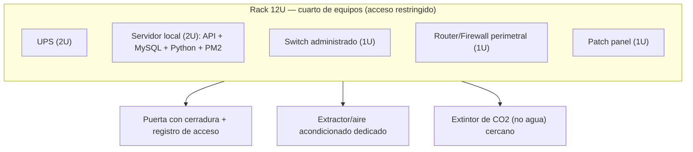

# Entregable 3: Diseño de Centro de Datos (CE0331)

## Portada

| Campo | Detalle |
|---|---|
| Título | Diseño del centro de datos local — Sede principal CERMAT |
| Competencia | CE033 — Implementación de Centro de Datos |
| Semestre | 1 |
| Integrantes | David Robert Yucra Mamani (líder), Gladys Rosaura Yana Pari, Denilson Leeke Mamani Flores, Cárdenas Vilca Rennzo |
| Ciclo académico | 9° ciclo |
| Fecha | 2026-07-06 |

## Resumen ejecutivo

CERMAT no requiere un centro de datos empresarial: requiere un **cuarto de equipos / rack pequeño** que aloje de forma confiable el servidor local de la capa complementaria (API Node.js, MySQL, analítica Python, PM2 con backups). Este documento dimensiona ese espacio con un nivel de disponibilidad realista (Tier I con elementos de Tier II), define su layout físico, dimensiona la capacidad de cómputo/almacenamiento necesaria, e incorpora un esquema de virtualización ligera para aislar y facilitar la recuperación de los servicios locales — complementando, no reemplazando, la capa cloud en Firebase que ya sostiene la operación en tiempo real.

## Sección 1: Definición de arquitectura (Tier I–IV, Uptime Institute)

| Tier (Uptime Institute) | Disponibilidad objetivo | ¿Aplica a CERMAT? |
|---|---|---|
| Tier I | ~99.671% — sin redundancia | Base mínima |
| **Tier II (parcial, adoptado)** | ~99.741% — redundancia parcial en componentes | **Sí** — UPS + doble enlace a internet, sin duplicar el servidor físico |
| Tier III | ~99.982% — mantenible sin interrupción | No — requiere doble ruta de energía/enfriamiento, fuera de escala para una sede escolar |
| Tier IV | ~99.995% — tolerante a fallos | No — costo y complejidad no justificados para el tamaño de la institución |

**Justificación:** la capa cloud (Firebase) ya provee alta disponibilidad para la operación en tiempo real de la plataforma; el servidor local existe para sincronización, reportes y analítica — su indisponibilidad temporal no detiene la matrícula ni los pagos en línea. Por eso se adopta un nivel **Tier II parcial**: redundancia en energía (UPS) y en conectividad (enlace de respaldo 4G/LTE, ver [Diseño de Red](e1-diseno-red-ce0311.md)), sin duplicar físicamente el servidor.

## Sección 2: Diseño de layout físico

- **Ubicación:** ambiente cerrado separado de la sala de docentes y de atención al público, con acceso restringido al encargado de soporte/TI y a dirección.
- **Control de acceso físico:** puerta con cerradura y bitácora de ingreso (quién, cuándo, motivo).
- **Climatización:** ventilación/extracción dedicada para mantener el rack por debajo de 27°C.
- **Protección contra incendio:** extintor de CO2 o polvo químico seco cerca del rack (nunca agua, por el riesgo eléctrico).

## Sección 3: Dimensionamiento de capacidad

| Recurso | Dimensionamiento propuesto | Justificación |
|---|---|---|
| CPU | 4 núcleos / 8 hilos | Suficiente para API Node.js + motor MySQL + servicio FastAPI de analítica corriendo simultáneamente con la carga real de una sede (decenas de usuarios concurrentes, no miles). |
| RAM | 16 GB | Margen cómodo para MySQL, Node.js, Python y el sistema operativo, con espacio para picos de sincronización. |
| Almacenamiento | 512 GB SSD (datos) + 1 TB HDD (backups locales) | El SSD prioriza velocidad de lectura/escritura de MySQL; el HDD de mayor capacidad guarda backups históricos según la política 3-2-1 (ver [Planificación de Seguridad](e2-planificacion-seguridad-ce0321.md)). |
| Proyección de crecimiento | +20% de capacidad cada 2 años | Alineado al crecimiento esperado de matrículas y colecciones documentado en el [resumen ejecutivo del sistema](../index.md#resumen-ejecutivo-del-sistema). |

## Sección 4: Incorporación de virtualización / cloud híbrido

- **Cloud híbrido (ya existente):** Firebase (Firestore, Auth, Storage) como capa cloud operativa; MySQL + API local como capa on-premise complementaria — ver [arquitectura por capas del Brief EPE](../brief-epe.md#7-enfoque-de-solucion).
- **Virtualización ligera propuesta para el servidor local:** ejecutar la API Node.js, MySQL y el servicio Python/FastAPI como **contenedores** (Docker) sobre el servidor físico, en vez de instalarlos directamente sobre el sistema operativo. Esto:
  - Aísla cada servicio (un fallo de un contenedor no arrastra a los demás).
  - Permite restaurar un servicio completo desde una imagen en minutos ante una falla.
  - Facilita mover la carga a otro equipo físico si el servidor actual necesita mantenimiento.
- PM2 continúa administrando los procesos dentro de cada contenedor, tal como opera hoy la capa local (ver [Brief EPE](../brief-epe.md#7-enfoque-de-solucion)).

## Anexos

- Diagrama de rack: ver sección 2.
- Cálculos de dimensionamiento: ver sección 3.

## Rúbrica de evaluación

*(6 criterios — máximo 24 puntos, según guía oficial de evaluación de perfil de egreso)*

| Criterio | Excelente (4) | Bueno (3) | Regular (2) |
|---|---|---|---|
| Definición de Arquitectura (Tier I–IV) | Justificada con análisis de necesidades y estándares. | Definida correctamente, pero sin análisis profundo. | Definida básicamente. |
| Diseño de Layout Físico | Diagramas detallados y realistas. | Diagramas adecuados, pero simplificados. | Diagramas básicos con errores. |
| Dimensionamiento de Capacidad | Cálculos precisos con proyecciones. | Cálculos básicos, sin proyecciones. | Cálculos parciales. |
| Incorporación de Virtualización/Cloud Híbrido | Integración detallada con beneficios y riesgos. | Integración básica. | Mencionada superficialmente. |
| Cumplimiento de Estándares | Referencias explícitas a Uptime y otros. | Referencias presentes, pero no integradas. | Mínimas referencias. |
| Calidad Documental y Ética | Profesional, con ética ACM integrada. | Buena estructura. | Básica. |
